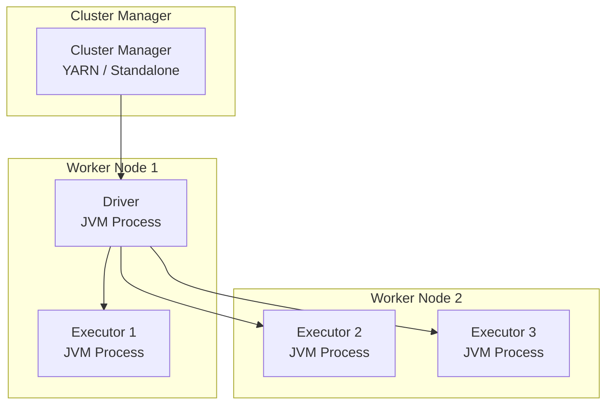
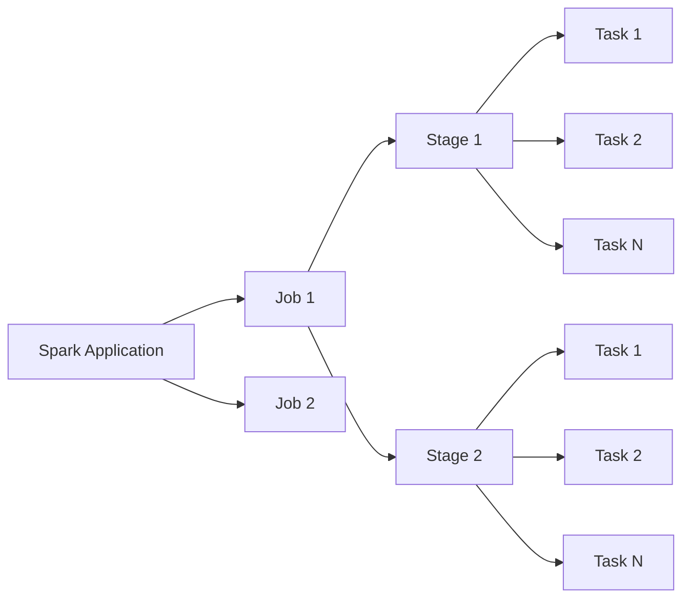
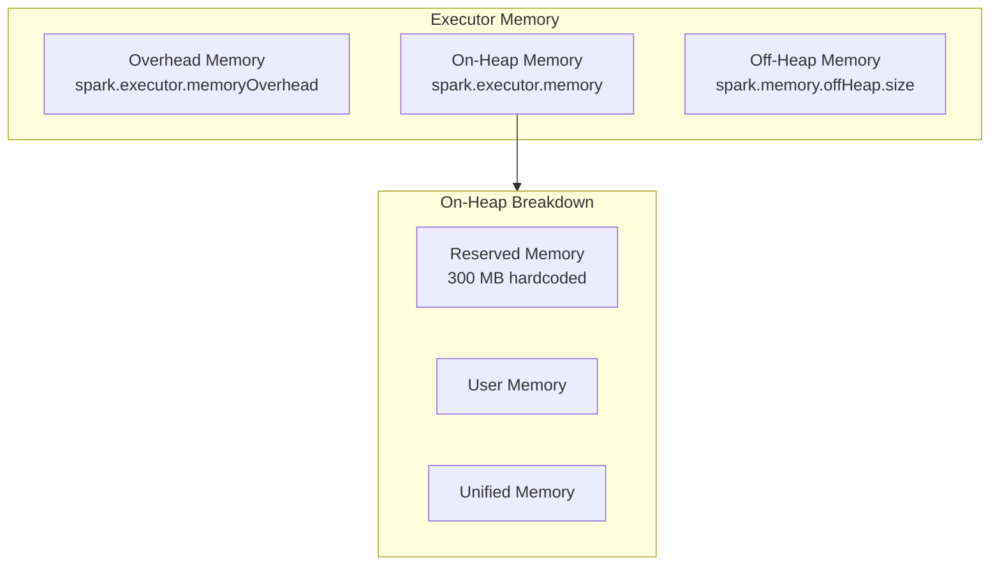
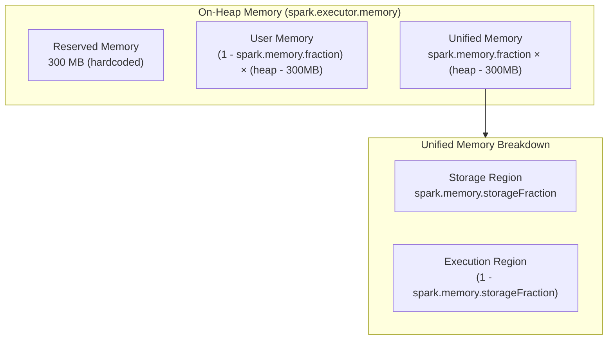
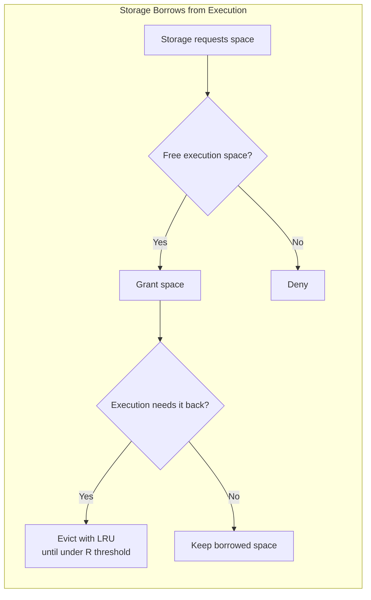
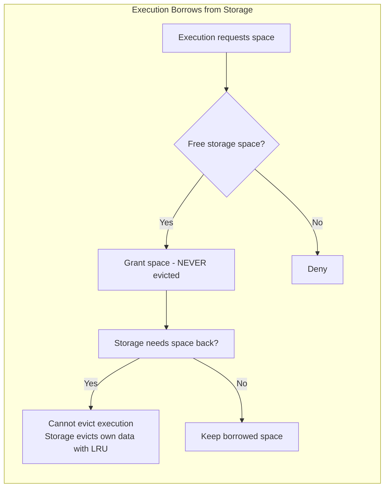
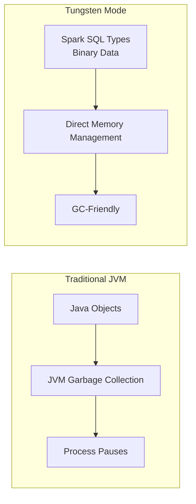

# Apache Spark Deep Dive

> [!abstract] Origin
> In **2009**, UC Berkeley's **AMPLab** developed Spark. At that time, MapReduce was the go-to choice for processing massive datasets, but it made building large applications inefficient, especially for ML tasks requiring multiple data passes.

> [!success] Why Spark Won
> Unlike MapReduce, which writes data to disks after every task, **Spark relies on in-memory processing**. With a friendly API, wide use cases, and efficient memory processing, Spark became the dominant solution in data processing.

---

## Spark Application Architecture



### Core Components

| Component | Description |
|-----------|-------------|
| **Driver** | JVM process that manages the Spark application, handles user input, and distributes work to executors |
| **Executors** | JVM processes that execute tasks assigned by driver and report status/results. Each Spark application has isolated executors. A single physical worker can have multiple executors. |
| **Cluster Manager** | Manages the cluster of machines. Spark works with YARN, Kubernetes, or Spark's standalone manager. |

> [!note] Cluster Manager vs Spark Processes
> The cluster manager has its own "master" and "worker" abstractions tied to **physical machines**, not Spark processes.

### Application Startup Flow

1. Cluster manager receives Spark application
2. Manager places driver process on a worker node
3. SparkSession requests resources from cluster manager
4. Manager launches executor processes
5. Manager sends executor locations to driver
6. Driver forms execution plan and schedules tasks

---

## Jobs, Stages, and Tasks



### Definitions

| Term | Definition |
|------|------------|
| **Job** | A series of transformations applied to data; encompasses entire workflow from start to finish |
| **Stage** | A job segment executed **without data shuffling**. Jobs split into stages when transformation requires shuffling across partitions. |
| **DAG** | Directed Acyclic Graph of stages built from RDD dependencies. Ensures stages are scheduled in topological order. |
| **Task** | Smallest unit of execution. Each stage divided into multiple tasks executing in parallel across different data partitions. |

> [!info] Parallel Execution
> Spark was designed to run tasks in parallel. An executor can handle **multiple tasks at the same time**. This is where "in-memory processing" happens.

---

## Executor Memory Management

> [!warning] Scope
> This section focuses on the **executor's memory management**.

### Memory Regions Overview



### Configuration Parameters

| Parameter | Description |
|-----------|-------------|
| `spark.driver.cores` | CPU cores for driver |
| `spark.driver.memory` | Memory for driver |
| `spark.executor.cores` | CPU cores per executor |
| `spark.executor.memory` | JVM heap memory per executor |

---

## On-Heap Memory

> [!info] Primary Memory Region
> This is the region we manage most of the time when running Spark. Specified by `spark.executor.memory`.

### On-Heap Memory Breakdown



### 1. Reserved Memory

> [!note] Hardcoded Region
> - Stores **internal Spark objects**
> - Users **cannot** specify amount
> - **Hardcoded at 300 MB**

### 2. User Memory

> [!info] Purpose
> Provides memory for:
> - User data structures (hash tables, arrays)
> - Spark's internal metadata
> - Safeguard against OOM errors in special cases

**Formula:**
```
User Memory = (1 - spark.memory.fraction) × (heap_size - 300MB)
```

### 3. Unified Memory

> [!tip] Configuration
> Specified by `spark.memory.fraction` (default: **0.6**)

#### Storage Region
- **Purpose:** Data caching and data broadcasting
- **Config:** `spark.memory.storageFraction` (default: **0.5**)

> [!example] Broadcast Join
> A join technique involving a large dataset and a much smaller one. Instead of shuffling the small dataset, it's **broadcast to all workers**. Reduces network overhead and speeds up joins when small dataset fits in memory.

#### Execution Region
- **Purpose:** Shuffling, joins, aggregations, sorting
- **Memory released** as soon as task completes

#### Example Calculation

Given:
- Executor memory: **4 GB**
- `spark.memory.fraction`: **0.6** (default)
- `spark.memory.storageFraction`: **0.5** (default)

```
Storage Memory = (4GB - 300MB) × 0.6 × 0.5 = ~1.11 GB

Execution Memory = (4GB - 300MB) × 0.6 × 0.5 = ~1.11 GB
```

---

## Unified Memory: Flexible Boundary

> [!success] Since Spark 1.6
> The boundary between execution and storage regions is **crossable**.

### Design Motivations

1. Tuning fractions requires expertise in Spark internals
2. Fixed fraction settings don't suit all workloads
3. Applications without caching waste storage regions

### Borrowing Rules





### Key Rules

| Direction | Rule |
|-----------|------|
| **Storage → Execution** | Can borrow free space. If execution needs it back, storage evicts data (LRU) until usage falls under **R threshold** (`storageFraction`). |
| **Execution → Storage** | Can borrow free space. **Never evicted** by storage. Intermediate computation data is critical — losing it causes process failure. |

> [!warning] R Threshold Protection
> The `storageFraction` defines a protected region where cached data **won't be evicted** by execution borrowing.

### Design Benefits

1. **No caching apps** → Use entire space for execution, limiting disk spills
2. **Caching apps** → Still have minimum protected storage space
3. **Adaptive** → Works reasonably for various use cases without expert tuning

---

## Off-Heap Memory

> [!info] Project Tungsten
> Introduced to address **GC inefficiency** and **JVM object overhead**.

### JVM Overhead Problem

| Data | JVM Object Size |
|------|-----------------|
| 4-byte string | **48+ bytes** |

### Tungsten Solution



- Operates directly against **binary data** rather than Java objects
- Represents objects as specialized **Spark SQL Types**
- Works with off-heap mode for even better performance

### Off-Heap Configuration

```yaml
spark.memory.offHeap.enabled: true
spark.memory.offHeap.size: <positive_value>
```

> [!note] Off-Heap Regions
> Only two regions (no reserved or user memory):
> - Execution
> - Storage
>
> Still subject to `spark.memory.storageFraction`

### Combined Memory Model

```
Total Execution = On-Heap Execution + Off-Heap Execution
Total Storage = On-Heap Storage + Off-Heap Storage
```

> [!tip] Key Point
> Enabling off-heap does **not impact** existing on-heap memory. They are additive.

---

## Overhead Memory

> [!note] Configuration
> `spark.executor.memoryOverhead`

### Purpose

Stores:
- Interned strings
- VM overheads
- Other native overheads

### Defaults

| Setting | Value |
|---------|-------|
| **Minimum** | 384 MB |
| **Growth factor** | `spark.executor.memoryOverheadFactor` (default: 10% of executor memory) |

> [!warning] Not Included
> Overhead memory is **NOT included** in `spark.executor.memory`.

### PySpark

If `spark.executor.pyspark.memory` is not specified, overhead memory is also used for PySpark executor memory.

---

## Memory Configuration Quick Reference

```yaml
# Driver Configuration
spark.driver.cores: 2
spark.driver.memory: 4g

# Executor Configuration
spark.executor.cores: 4
spark.executor.memory: 8g
spark.executor.memoryOverhead: 1g

# Memory Fractions
spark.memory.fraction: 0.6           # Default
spark.memory.storageFraction: 0.5    # Default

# Off-Heap (Optional)
spark.memory.offHeap.enabled: false  # Default
spark.memory.offHeap.size: 2g
```

---

## Key Takeaways

> [!abstract] Summary
>
> 1. **Executor Memory** has three regions: on-heap, off-heap, and overhead
> 2. **On-Heap** is divided into reserved (300MB), user, and unified memory
> 3. **Unified Memory** has flexible boundary between storage and execution since Spark 1.6
> 4. **Execution memory is protected** — cannot be evicted once borrowed
> 5. **Storage can be evicted** when execution reclaims memory (down to R threshold)
> 6. **Off-heap memory** bypasses JVM GC for better performance (Project Tungsten)
> 7. **Overhead memory** stores VM/native overheads, separate from heap

---

## Related Notes

- [[Databricks Runtime]]
- [[Unity Catalog]]
- [[System Design]]
- [[Streaming]]

---

> [!quote] Reference
> Article: *I spent 8 hours understanding Apache Spark's memory management* — Vu Trinh
