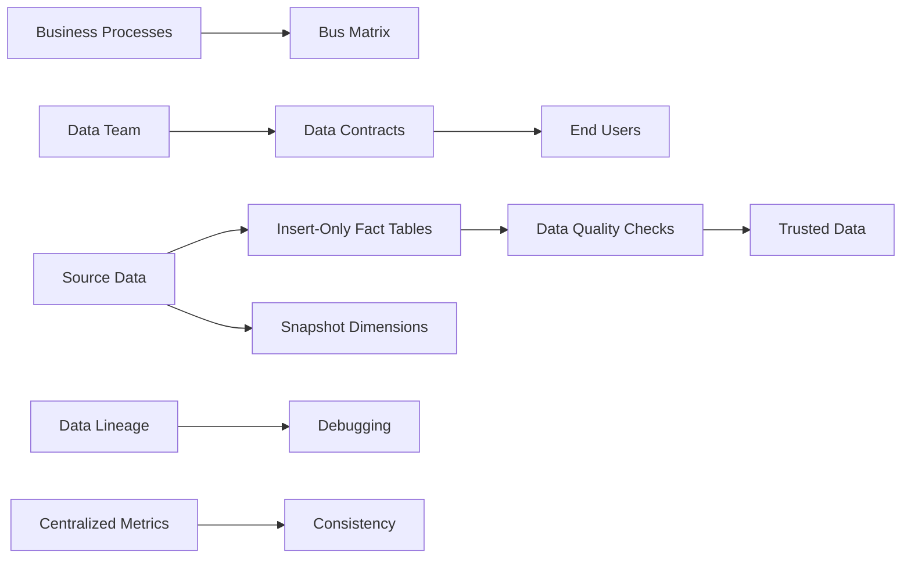
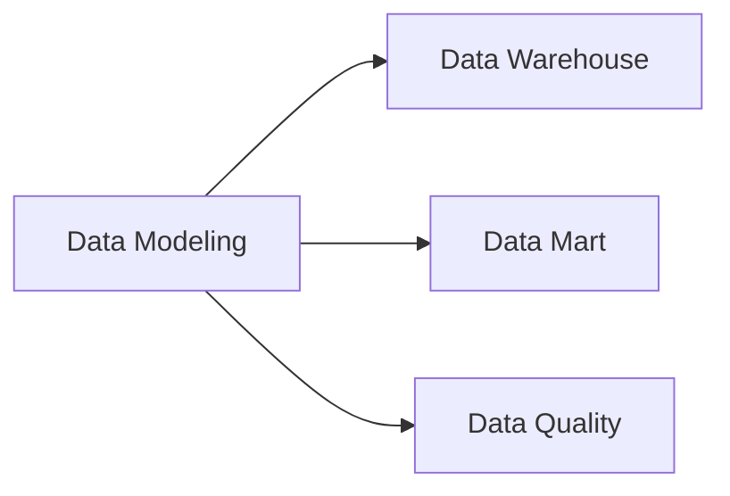

# Data Modeling

> [!abstract] What is Data Modeling?
> Data modeling is the **structured process of defining how data is organized, stored, and interrelated** within a system. It acts as a blueprint, mapping relationships between different data elements, establishing rules to maintain data integrity, and determining how information flows through the system.

> [!warning] The Problem with Messy Data
> Having data alone is not enough if it is messy, disorganized, or not properly arranged. Data in this state is like **garbage lying around**: it exists, but it is unusable. To make data useful, extract insights, apply analytics, or build models, we need to organize and structure it.

## Why Data Modeling Matters

- Ensures tables are built with consistent standards rather than haphazardly
- Reduces technical debt from quick fixes
- Helps demonstrate value to stakeholders
- Builds trust between data teams and end users
- Enables predictable career growth for data engineers
- Makes data **accessible, understandable, and useful** for end users or stakeholders

---

## Problems Where Data Modeling Is Needed

> [!tip] When to Apply Data Modeling

| Scenario | Description |
|----------|-------------|
| **Designing New Systems** | Define entities, attributes, and relationships before any data exists |
| **Integrating Multiple Sources** | Unify and structure data from different formats and systems |
| **Building Analytical/BI Systems** | Create clean, connected, and queryable data for reporting |
| **ML & AI Pipelines** | Ensure consistent, structured features and metadata |
| **Evolving Systems** | Create flexible models for new business requirements |

---

## Types of Data Models

> [!info] Three Levels of Data Design
> There are three main types of data models, each representing a different stage of data design. These models help move from business understanding to actual database implementation.

### 1. Conceptual Data Model

> [!note] High-Level Business View
> A conceptual data model provides a **high-level view of the data**. It defines key business entities and their relationships without getting into technical details.

**Characteristics:**
- Used during early planning and stakeholder discussions
- Focuses purely on business concepts
- Uses **Entity-Relationship (ER) modeling**

**Example:** An ER diagram showing how Customers, Orders, and Products relate to each other.

### 2. Logical Data Model

> [!tip] Bridge Between Business and Technology
> The logical data model defines **how data will be structured** while remaining independent of any specific database technology.

**Characteristics:**
- Detailed definitions of attributes, relationships, and constraints
- Technology-agnostic
- Uses ER modeling, dimensional modeling, or object-oriented modeling

**Example:** A star schema defining a Sales fact table with dimension tables (Time, Product, Customer) — without deciding storage implementation.

### 3. Physical Data Model

> [!success] Implementation-Ready Design
> The physical data model represents **how data is actually stored** in a database system.

**Characteristics:**
- Defines tables, indexes, partitions, and storage mechanisms
- Optimized for performance and scalability
- Database-specific implementation

**Example:** An optimized star schema in PostgreSQL or MongoDB documents storing user profiles as JSON.

---

## Dimensional Modeling

> [!abstract] What is Dimensional Modeling?
> Dimensional modeling is a type of data modeling **specifically designed for analytical systems**. Its primary goal is improved query performance and simpler data access.

**Why It's Popular:**
- Balances **Performance**, **Simplicity**, and **Business understanding**
- Most widely used approach in modern data stacks
- Categorizes data into two buckets: **Facts** and **Dimensions**

### Facts vs Dimensions

| Aspect | Facts | Dimensions |
|--------|-------|------------|
| **Represents** | Actions, events, results (verbs) | Context, entities (nouns) |
| **Examples** | Account created, Payment made, Email sent | Users, Customers, Products, Time |
| **Contains** | Often numeric values | Descriptive attributes |
| **Answers** | "What happened?" | "Who/what/where/when?" |

> [!tip] Simple Rule of Thumb
> - If it feels like an **event** → model it as a **fact**
> - If it feels like **context** → model it as a **dimension**
>
> Don't overthink it! Data models can evolve. You're not a surgeon — no one will die if you remodel a table later.

### Drawbacks of Dimensional Modeling

> [!warning] Common Challenges
> - **BI tool dependency**: Some BI tools don't handle joins efficiently
> - **Wide table issues**: Others struggle with very wide tables
> - **Performance impact**: Poor tooling can lead to slow or complex queries
>
> **Solution:** Align your data model with your query engine and BI stack.

---

## Data Modeling in Data Warehouses

> [!info] What is a Data Warehouse?
> A data warehouse is primarily used for **OLAP (Online Analytical Processing)** workloads. It optimizes for:
> - Read performance
> - Aggregations
> - Joins
> - Historical analysis

### Common Techniques

| Technique | Description |
|-----------|-------------|
| **Star Schema** | Central fact table joins directly to multiple dimension tables |
| **Snowflake Schema** | Extension of star schema where dimensions are further normalized |

> [!note] Related Notes
> See [[Star Schema]] and [[Snowflake Schema]] for detailed patterns.

---

## Six Techniques for Production-Ready Tables

### 1. Bus Matrix - Demonstrate Value

A **bus matrix** is a table where:
- Each **row** represents a **business process**
- Each **column** represents a **business dimension**
- Cell values indicate whether that dimension is associated with the row's business process

**Example for a Bike Part Seller:**

| Business Process | Customer | Supplier | Part | Order Date | Ship Date |
| --- | --- | --- | --- | --- | --- |
| Order Purchases | ✓ |  |  | ✓ |  |
| Order Returns | ✓ | ✓ | ✓ | ✓ | ✓ |
| LineItem Discounts | ✓ | ✓ | ✓ | ✓ | ✓ |

**Benefits:**
- Ties work to business outcomes stakeholders care about
- Demonstrates progress and value to the company
- Serves as a form of short ERD

### 2. Data Contracts - Set End-User Expectations

A **data contract** is a document that outlines what end-users can expect from a dataset. It should be easily discoverable and viewable by end users.

**Five Essential Data Contract Attributes:**

1. **Table Grain**: What each row in the table means
2. **SLA**: Time between event occurrence and data availability
3. **Table Schema**: Column names and their data types
4. **Owner**: Team to contact for questions (including expected response times)
5. **Data Quality Checks**: List of checks run on the table (understandable by end-users)

### 3. Insert-Only Fact Tables and Snapshot Dimensions

Most business questions can be answered with well-defined Kimball fact and dimension tables.

**Seven Techniques for Maintainable Tables:**

1. **Insert Only Fact Tables**: Do not update once data is inserted (unless backfilling)
2. **Snapshot Dimension Tables**: Complete recreation of dimension tables for each pipeline run. Keep historical data. SCD2 should be limited
3. **Only One Grain Per Table**: Multiple grains cause issues with joins or group by operations
4. **Combine Flag Conditioned Columns**: If a column's usage depends on another flag, combine into individual columns (e.g., `FLAG_COL_VALUE_1_COLUMN_NAME`)
5. **Use Naming Conventions**: Follow standards like Kimball naming convention
6. **Do Not Create Surrogate Keys**: Modern technology allows direct joins between fact and dimension tables
7. **Create a View Interface**: Protect end users from underlying schema changes; with snapshot tables, use views to select the most recent snapshot

### 4. Data Quality Checks - Prevent High-Impact Issues

Using incorrect data can cause irreversible damage and loss of trust. Implement these 4 high-ROI data quality checks:

1. **Table Constraints**: Uniqueness checks, allowed value checks, not null checks
2. **Referential Integrity Checks**: Ensure column values in one table have corresponding values in another (e.g., dimension keys in fact tables must exist in dimension tables)
3. **Reconciliation Checks**: Row counts and key numerical aggregates (revenue) should match or be within threshold of source table
4. **Metric Variance Check**: Current run's metrics should not deviate significantly from historical values

Use the **WAP (Write-Audit-Publish) pattern** to run DQ checks.

### 5. Data Lineage - Debug Data Issues

**Data lineage** tracks the source and transformation path of data, enabling you to:
- Answer questions about data sources
- Determine where logic bugs exist
- Meet audit requirements in healthcare, finance, and other regulated industries

Tools that offer lineage out of the box: SQL Mesh, dbt, etc.

### 6. Centralize Metric Definitions

As companies grow, metrics and teams tracking them multiply. Centralized definitions make identification and debugging easier.

**Two Main Options:**

1. **Semantic Layer**: Define metric definitions and have systems re-query them as needed
2. **Data Mart Tables**: Tables with metrics available to query

**Key Principle**: Ensure metrics have clear ownership. Scattered metrics make debugging difficult.

---

## Best Practices for Data Modeling

> [!success] Key Principles

### 1. Understand Business Requirements
Ensure the model supports the insights needed for decision-making. Before creating schemas:
- What insights are needed?
- How will data be accessed and updated?
- What performance trade-offs are acceptable?

### 2. Design for Flexibility
Allow the model to scale and adapt as business needs change.

### 3. Optimize for Query Performance
Use indexing, partitioning, and denormalization where appropriate.

### 4. Maintain Data Integrity
Apply constraints and relationships to prevent inconsistencies.

### 5. Document the Data Model
Clear documentation ensures the model is understandable and maintainable.

---

## Choosing the Right Approach

> [!tip] Questions to Ask Before Committing

| Question | Consideration |
|----------|---------------|
| What are the primary end-use cases? | Determines structure needed |
| Who will query the data? | Affects complexity and naming |
| How many data sources are involved? | Impacts integration strategy |
| Which technique fits our stack? | Align with tools and warehouse |
| How will this support governance? | Standardization requirements |

### Decision Factors

When selecting a modeling approach, consider:
- **Analytical requirements**: What questions need to be answered?
- **Data volume and scalability**: How much data exists now and in the future?
- **Ease of use**: Who will query the data?
- **Flexibility**: How often will requirements change?
- **Performance trade-offs**: Faster queries vs increased storage and redundancy

---

> [!quote] The Best Technique Is a Consistent One
> There's no single "right" or "wrong" data modeling technique — the best choice depends on your data, business needs, and team skillset. Choose a technique that is **practical, scalable, and consistent** across your organization.

---

## When to Break These Recommendations

These techniques are guidelines, not rules. Break them when you have a clear, specific use case that requires deviation.

## Prerequisites

- Basics of Data Warehousing
- Basics of Fact and Dimension tables

## Related Concepts

- [Data Warehouse](Data%20Warehouse.md)
- [Data Mart](Data%20Mart.md)

## Knowledge Graph Connections

---

## Conclusion

> [!abstract] Key Takeaway
> Data modeling is the **foundation that turns raw data into reliable insights**. While it applies across many systems, it becomes most critical in analytical and data warehouse environments where structure, performance, and consistency matter.
>
> A well-designed data model:
> - Reflects business needs
> - Enables efficient analytics
> - Builds trust in data
>
> **If data is meant to drive decisions, strong data modeling is essential.**

---

**Sources:**
- [Start Data Engineering - Six Data Modeling Techniques](https://www.startdataengineering.com/post/fast-consistent-data-model/)
- Data Modeling Fundamentals Guide
