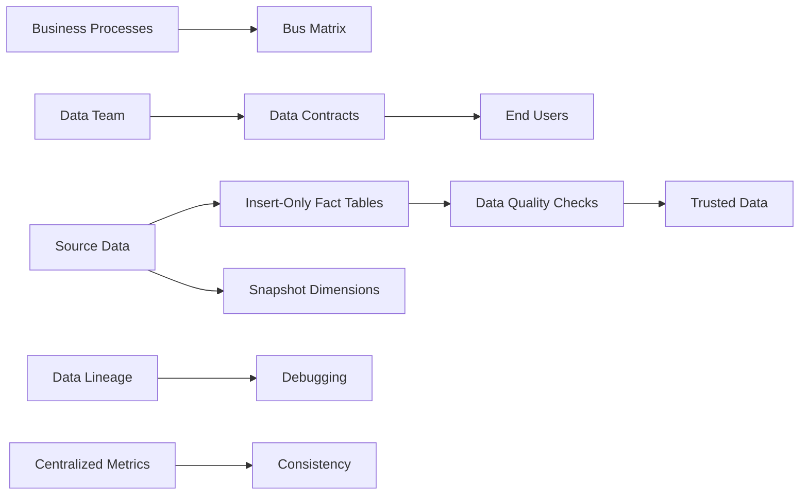
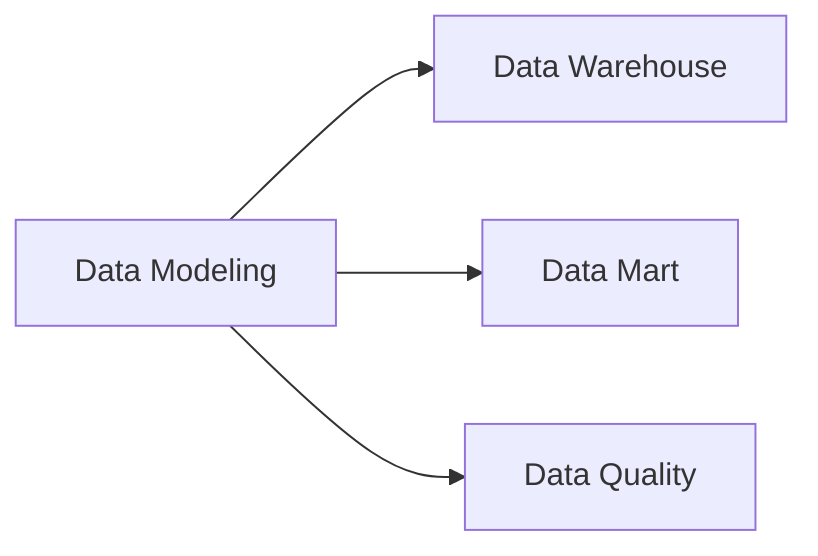

# Data Modeling

Data modeling is the process of creating a data model for the data to be stored in a data warehouse. It organizes data elements and standardizes how the individual data elements relate to one another. A well-designed data model enables fast, consistent delivery of production-ready tables while maintaining data quality and reducing technical debt.

## Why Data Modeling Matters

- Ensures tables are built with consistent standards rather than haphazardly
- Reduces technical debt from quick fixes
- Helps demonstrate value to stakeholders
- Builds trust between data teams and end users
- Enables predictable career growth for data engineers

## Six Techniques for Production-Ready Tables

### 1. Bus Matrix - Demonstrate Value

A **bus matrix** is a table where:
- Each **row** represents a **business process**
- Each **column** represents a **business dimension**
- Cell values indicate whether that dimension is associated with the row's business process

**Example for a Bike Part Seller:**

| Business Process | Customer | Supplier | Part | Order Date | Ship Date |
| --- | --- | --- | --- | --- | --- |
| Order Purchases | ✓ |  |  | ✓ |  |
| Order Returns | ✓ | ✓ | ✓ | ✓ | ✓ |
| LineItem Discounts | ✓ | ✓ | ✓ | ✓ | ✓ |

**Benefits:**
- Ties work to business outcomes stakeholders care about
- Demonstrates progress and value to the company
- Serves as a form of short ERD

### 2. Data Contracts - Set End-User Expectations

A **data contract** is a document that outlines what end-users can expect from a dataset. It should be easily discoverable and viewable by end users.

**Five Essential Data Contract Attributes:**

1. **Table Grain**: What each row in the table means
2. **SLA**: Time between event occurrence and data availability
3. **Table Schema**: Column names and their data types
4. **Owner**: Team to contact for questions (including expected response times)
5. **Data Quality Checks**: List of checks run on the table (understandable by end-users)

### 3. Insert-Only Fact Tables and Snapshot Dimensions

Most business questions can be answered with well-defined Kimball fact and dimension tables.

**Seven Techniques for Maintainable Tables:**

1. **Insert Only Fact Tables**: Do not update once data is inserted (unless backfilling)
2. **Snapshot Dimension Tables**: Complete recreation of dimension tables for each pipeline run. Keep historical data. SCD2 should be limited
3. **Only One Grain Per Table**: Multiple grains cause issues with joins or group by operations
4. **Combine Flag Conditioned Columns**: If a column's usage depends on another flag, combine into individual columns (e.g., `FLAG_COL_VALUE_1_COLUMN_NAME`)
5. **Use Naming Conventions**: Follow standards like Kimball naming convention
6. **Do Not Create Surrogate Keys**: Modern technology allows direct joins between fact and dimension tables
7. **Create a View Interface**: Protect end users from underlying schema changes; with snapshot tables, use views to select the most recent snapshot

### 4. Data Quality Checks - Prevent High-Impact Issues

Using incorrect data can cause irreversible damage and loss of trust. Implement these 4 high-ROI data quality checks:

1. **Table Constraints**: Uniqueness checks, allowed value checks, not null checks
2. **Referential Integrity Checks**: Ensure column values in one table have corresponding values in another (e.g., dimension keys in fact tables must exist in dimension tables)
3. **Reconciliation Checks**: Row counts and key numerical aggregates (revenue) should match or be within threshold of source table
4. **Metric Variance Check**: Current run's metrics should not deviate significantly from historical values

Use the **WAP (Write-Audit-Publish) pattern** to run DQ checks.

### 5. Data Lineage - Debug Data Issues

**Data lineage** tracks the source and transformation path of data, enabling you to:
- Answer questions about data sources
- Determine where logic bugs exist
- Meet audit requirements in healthcare, finance, and other regulated industries

Tools that offer lineage out of the box: SQL Mesh, dbt, etc.

### 6. Centralize Metric Definitions

As companies grow, metrics and teams tracking them multiply. Centralized definitions make identification and debugging easier.

**Two Main Options:**

1. **Semantic Layer**: Define metric definitions and have systems re-query them as needed
2. **Data Mart Tables**: Tables with metrics available to query

**Key Principle**: Ensure metrics have clear ownership. Scattered metrics make debugging difficult.

## When to Break These Recommendations

These techniques are guidelines, not rules. Break them when you have a clear, specific use case that requires deviation.

## Prerequisites

- Basics of Data Warehousing
- Basics of Fact and Dimension tables

## Related Concepts

- [Data Warehouse](Data%20Warehouse.md)
- [Data Mart](Data%20Mart.md)

## Knowledge Graph Connections

---

**Source**: [Start Data Engineering - Six Data Modeling Techniques](https://www.startdataengineering.com/post/fast-consistent-data-model/)
