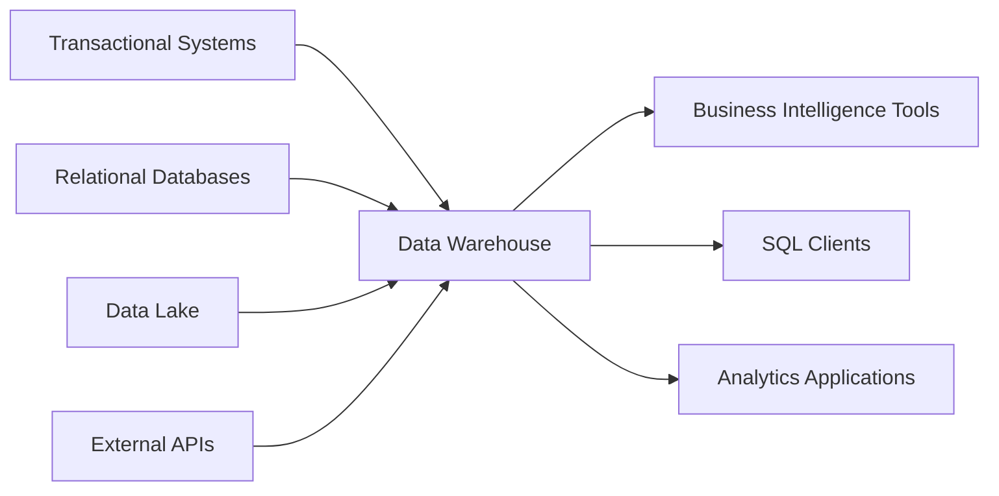
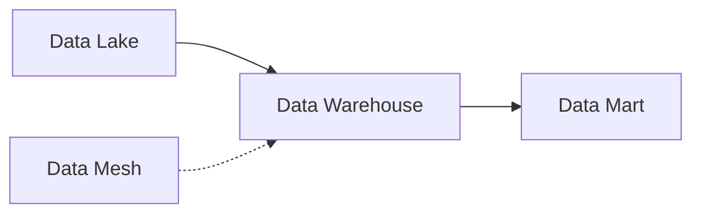

# Data Warehouse

A data warehouse is a central repository for data which will be used for reporting and analytics. Data comes into the data warehouse from transactional systems, relational databases, or other sources (like Data Lakes) usually on a regular cadence. Business analysts, data engineers, data scientists, and decision makers then access the data through business intelligence tools, SQL clients, and other analytics applications. Because the primary use cases for a data warehouse revolve around analytics, they typically use an OLAP (Online Analytical Processing) technology for performance.

## Data Warehouse Advantages

- Consolidate data from multiple data sources into one "source of truth"
- Optimized for read access which makes generating reports faster than using a source transaction system for reporting
- Store and analyze large amounts of historical data

## Data Warehouse Disadvantages

- A significant investment of time and resources to properly build
- Not designed for ingesting data in real-time (although they can typically handle near real-time)

## When to Use a Data Warehouse

Data warehouses are made for complex queries on large datasets. You should consider a data warehouse if you're looking to keep your historical data separate from current transactions for performance reasons.

## Popular Data Warehouses

- Amazon Redshift
- Azure Synapse Analytics
- Google BigQuery
- Microsoft SQL Server
- Snowflake

## Data Warehouse Benchmarks

- **1 TB**: [2020 - Redshift, Snowflake, Presto and BigQuery](https://fivetran.com/blog/warehouse-benchmark)
- **30 TB**: [2019 - Redshift, Azure SQL Data Warehouse, BigQuery, Snowflake](https://gigaom.com/report/cloud-data-warehouse-performance-testing/)

## Knowledge Graph Connections

**Related Patterns**:
- Can be partitioned into [Data Marts](Data%20Mart.md)
- Often fed by [Data Lakes](Data%20Lake.md)
- Can coexist with [Data Mesh](Data%20Mesh.md) architecture

---

**Source**: [Data Engineering Wiki](https://dataengineering.wiki/Concepts/Data+Architecture/Data+Warehouse)
