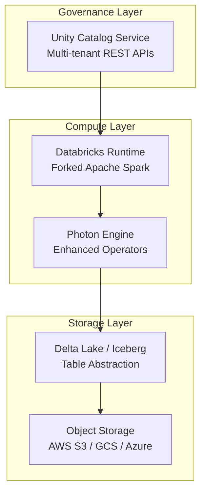
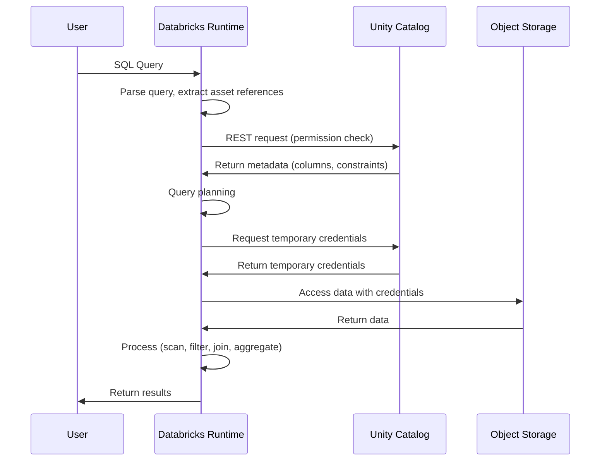
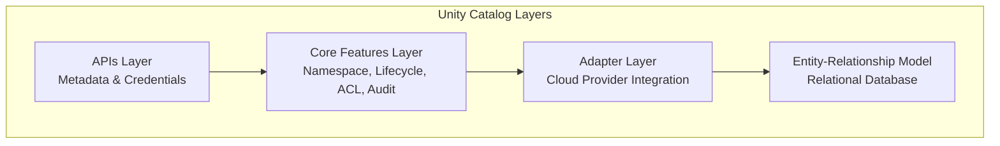
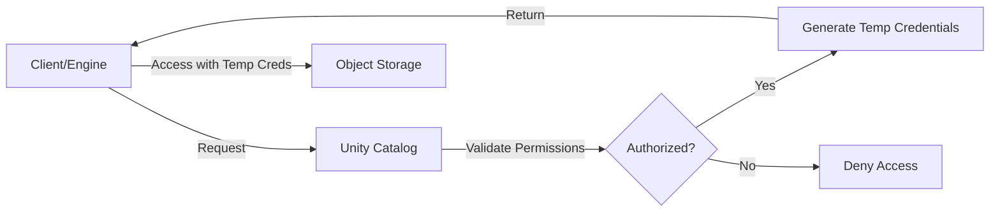
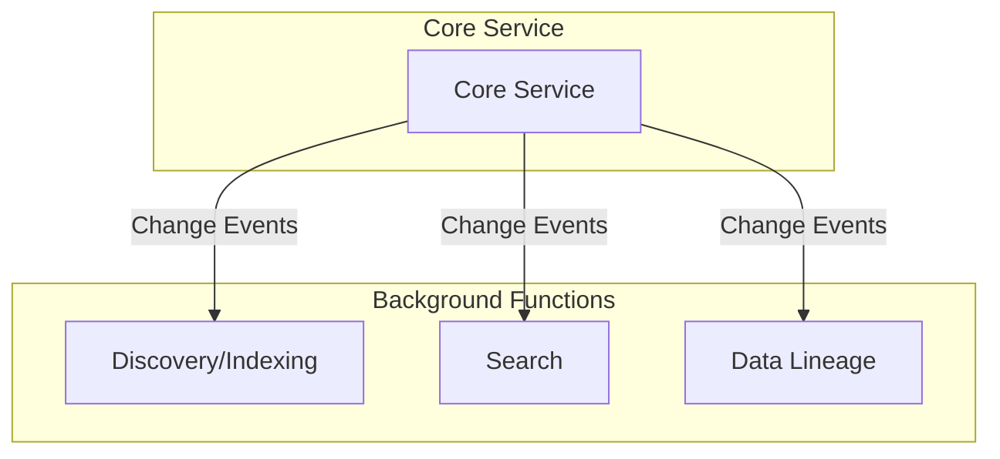
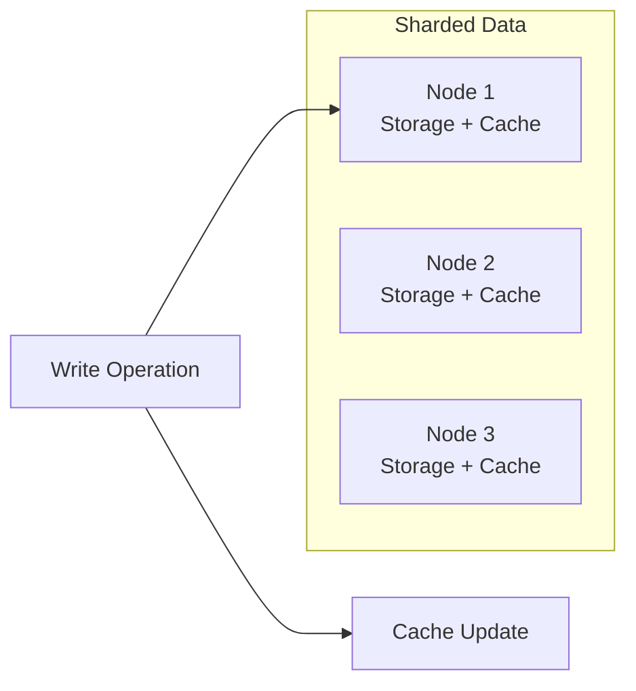

# Unity Catalog

> [!abstract] What is a Catalog?
> In any database, a catalog is a **central repository** that stores metadata for all database objects, such as tables, columns, views, users, and relationships, acting as a directory to help the system find, understand, and manage data.

> [!info] Lakehouse Catalog
> In the lakehouse world, the catalog is the **central metadata layer**, serving as a unified directory to discover, govern, and manage data across diverse sources (such as data lakes and warehouses) by tracking tables, schemas, and access rules, enabling analytic engines and AI models to access data without moving it.

---

## Overview

**Unity Catalog (UC)** is Databricks' catalog service that has served as their proprietary product before being **open-sourced in 2025**. It provides robust governance for the lakehouse architecture.

> [!success] Scale Metrics (as of paper publication)
> - **9,000** Databricks customers served since 2021
> - **100 million** tables under management
> - **400,000** machine learning models
> - **60,000** API calls per second

---

## Problems Unity Catalog Solves

> [!warning] Key Challenges Addressed

### 1. Uniform Access Control
A secure approach to let Lakehouse users access assets (tables, ML models) in **both ways**:
- Via catalog reference
- Via direct cloud storage path

### 2. Support for Diverse Asset Types
The catalog must support a wide range of assets beyond just tables, including **ML models**.

### 3. External Access
Data sharing capability via the catalog that **avoids data copying** (reducing storage cost and synchronization complexity).

### 4. Discovery Support
Assets must be **discoverable and understandable** with transparent lifecycle and lineage.

### 5. Performance
Fast metadata operations despite high load requirements.

---

## Databricks Lakehouse Architecture



### Three Key Components

| Component | Description |
|-----------|-------------|
| **Storage** | Object storage (AWS, GCP, Azure) with metadata layer (Delta Lake / Iceberg) providing table abstraction |
| **Databricks Runtimes (DBR)** | Fork of Apache Spark with reliability and performance enhancements, plus Photon engine for analytical workloads |
| **Unity Catalog Service** | Multi-tenant service providing all UC functionality and APIs |

---

## SQL Query Journey

> [!info] How a Query Flows Through Unity Catalog



### Step-by-Step

1. **Parse** — DBR receives SQL query and extracts data asset references (table/view names)
2. **Authorize** — DBR sends REST request to UC to verify user permissions
3. **Metadata** — UC returns asset metadata (column definitions, constraints)
4. **Plan** — DBR uses metadata for query planning
5. **Credential** — DBR requests temporary credential from UC
6. **Access** — DBR accesses data using returned credentials
7. **Process** — Query executes (scan, filter, join, aggregate)
8. **Result** — Results sent back to user

---

## System Design

### 1. Disaggregation of Catalog and Engine

> [!tip] Key Design Decision
> Unity Catalog is an **independent service**, not tied to any specific query engine.

**Benefits:**
- **Security** — UC acts as gatekeeper; only authorized users access assets
- **Interoperability** — Different query engines can work with UC-managed data via REST API (no metadata replication)

### 2. Diverse Asset Types Management



#### Entity-Relationship Model
- **Foundation** for all metadata operations
- Exposes methods for:
  - ID/name-based lookup
  - Parent-child relationship mapping
  - Privilege grant management
  - State management for provisioning/cleanup
- **Extensible** for specific asset types

#### Adapter Layer
- Integration points for different asset types with various cloud providers

#### Asset Type Registration
```yaml
# Asset Type Manifest
location: model_hierarchy_position
operations: [create, read, update, delete]
privileges: [select, modify, manage]
lifecycle_rules: custom_rules
```

#### Core Features Layer
- Namespace management
- Lifecycle management
- Access control
- Audit logging

### 3. Access Control

> [!danger] Two-Level Security

#### Metadata Security
- Handled directly through UC's REST APIs
- System validates user permissions based on operation

#### Data Security
- **No direct storage access** for clients
- Administrators grant storage permissions **only to UC**
- Clients request **temporary credentials** from UC



#### Fine-Grained Access Control (Row/Column Security)
- **Two-level access control** with engine cooperation
- UC protects metadata and data
- **Engine enforces** row and column security

### 4. Discoverable Catalog

> [!note] Event-Driven Architecture



**Design Principles:**
- Core service sends **change events** to background functions
- Background functions update indexes and lineage graphs
- **Independent scaling** of core and background services
- **Failure isolation** — one service failure doesn't impact others
- Access control ensures only **authorized clients** discover assets

### 5. Performance Optimizations

> [!success] Key Optimizations

#### Batching & Caching
| Strategy | Description |
|----------|-------------|
| **Batching** | Multiple asset requests batched together |
| **Immutable Metadata Cache** | Cached at UC service and query engines (e.g., temporary credentials) |
| **Mutable Metadata Cache** | Write-through cache for relational database |

#### Write-Through Cache Architecture


> [!info] Write-Through Cache
> Data is written **simultaneously** to cache and primary storage, ensuring cache always contains the most recent data.

#### Cache Eviction Strategies

1. **Standard Algorithms** — LRU discards unpopular cached entities
2. **Timeout-Based** — Caps cached versions of popular entities
   - New version populates cache
   - Existing versions used for max timeout period
   - UC API call timeout enforces the limit

#### Isolation Levels

| Level | Description |
|-------|-------------|
| **Snapshot Isolation (SI)** | Each read transaction sees consistent snapshot of all changes committed before it started |
| **Serializable Isolation** | Strongest level — parallel transactions appear as if run serially |
| **SSI (Serialized Snapshot Isolation)** | SI + conflict detection between writes; aborts non-read-only transactions if reading snapshot became stale |

---

## Key Takeaways

> [!abstract] Summary
>
> 1. **Independent Service** — Decoupled from query engines for security and interoperability
> 2. **Extensible Asset Model** — ER-based model supports diverse asset types
> 3. **Unified Governance** — Single point for metadata and data access control
> 4. **Fine-Grained Security** — Row/column level with engine cooperation
> 5. **Event-Driven Discovery** — Background functions for search and lineage
> 6. **Performance Optimized** — Multi-level caching, batching, and proper isolation levels

---

## Related Notes

- [[Lakehouse Architecture]]
- [[Delta Lake]]
- [[Data Governance]]
- [[System Design]]

---

> [!quote] Reference
> Paper: *Unity Catalog: Open and Universal Governance for the Lakehouse and Beyond* — Databricks
