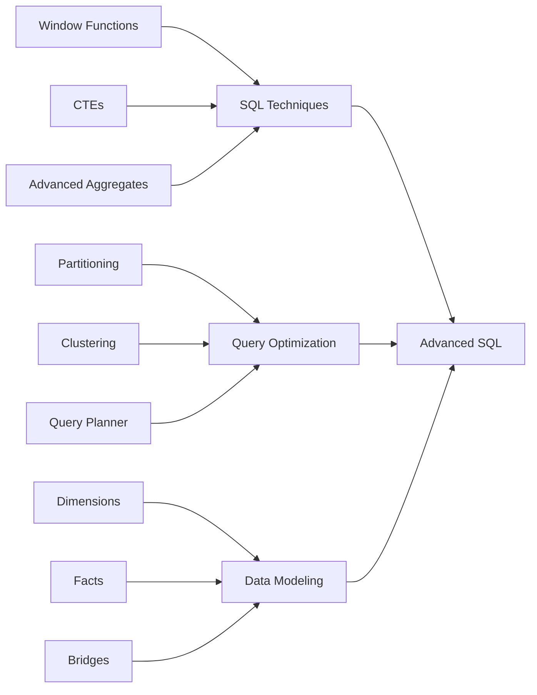
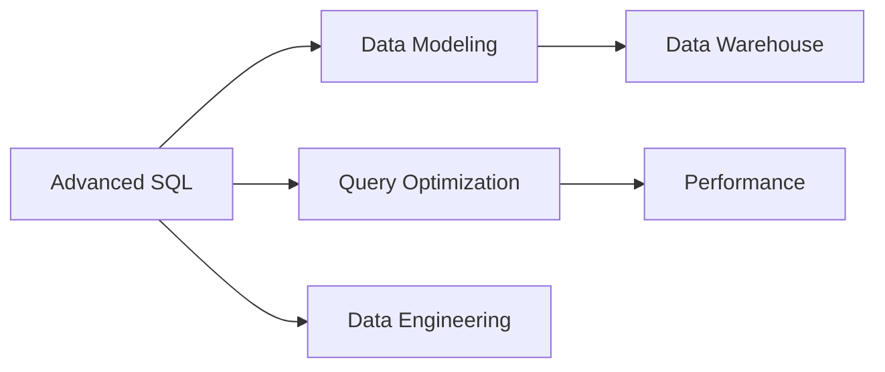

# Advanced SQL

**Advanced SQL involves knowing how to model data (data modeling) and retrieve it effectively (SQL techniques and query optimization).**

Most data engineering job descriptions expect "knowledge of advanced SQL," but few can clearly define what that means. This guide breaks down the essential components.

## What is Advanced SQL?

Advanced SQL = **Data Modeling** + **SQL Techniques** + **Query Optimization**

It's not just knowing complex functions, but understanding how to structure data for efficient access and retrieve it effectively.

## 1. SQL Techniques

These are the core techniques that distinguish intermediate from advanced SQL users:

### Window Functions
Perform calculations across a set of table rows related to the current row without collapsing rows.

```sql
-- Calculate running total by department
SELECT
    employee_id,
    department,
    salary,
    SUM(salary) OVER (
        PARTITION BY department
        ORDER BY hire_date
        ROWS BETWEEN UNBOUNDED PRECEDING AND CURRENT ROW
    ) as running_total
FROM employees;
```

### Common Table Expressions (CTEs)
Temporary result sets that make complex queries more readable and modular.

```sql
WITH customer_orders AS (
    SELECT customer_id, COUNT(*) as order_count
    FROM orders
    GROUP BY customer_id
),
high_value_customers AS (
    SELECT customer_id
    FROM customer_orders
    WHERE order_count > 10
)
SELECT c.*, co.order_count
FROM customers c
INNER JOIN high_value_customers hvc ON c.customer_id = hvc.customer_id
INNER JOIN customer_orders co ON c.customer_id = co.customer_id;
```

### JOIN Types
Understanding when to use each join type:
- **INNER JOIN**: Only matching rows
- **LEFT JOIN**: All from left, matching from right
- **RIGHT JOIN**: All from right, matching from left
- **FULL OUTER JOIN**: All from both tables
- **CROSS JOIN**: Cartesian product (every combination)
- **SEMI/ANTI JOIN**: EXISTS/NOT EXISTS patterns

### MERGE INTO (UPSERT)
Insert or update records in a single operation.

```sql
MERGE INTO target_table t
USING source_table s
ON t.id = s.id
WHEN MATCHED THEN
    UPDATE SET t.value = s.value, t.updated_at = CURRENT_TIMESTAMP
WHEN NOT MATCHED THEN
    INSERT (id, value, created_at)
    VALUES (s.id, s.value, CURRENT_TIMESTAMP);
```

### EXPLODE / CROSS JOIN with Arrays
Work with nested data structures (arrays, structs).

```sql
-- Explode array to individual rows
SELECT
    order_id,
    item.product_id,
    item.quantity
FROM orders
CROSS JOIN UNNEST(items) as item;

-- Or with LATERAL VIEW (Hive/Spark SQL)
SELECT
    order_id,
    item.product_id,
    item.quantity
FROM orders
LATERAL VIEW EXPLODE(items) exploded_table AS item;
```

### Advanced Aggregates
Beyond COUNT, SUM, AVG:

```sql
-- Percentile
SELECT
    PERCENTILE_CONT(0.5) WITHIN GROUP (ORDER BY salary) as median_salary
FROM employees;

-- Hypothetical set
SELECT
    product_id,
    RANK() OVER (ORDER BY total_sales DESC) as sales_rank
FROM product_sales;

-- Statistical functions
SELECT
    department,
    STDDEV(salary) as salary_stddev,
    VAR_SAMP(salary) as salary_variance,
    CORR(salary, years_experience) as salary_experience_correlation
FROM employees
GROUP BY department;
```

## 2. Query Optimization

The goal is to **reduce the amount of data processed** and **increase cluster resource utilization**.

### Narrow vs Wide Transformations

- **Narrow transformations**: One input row → one output row (no shuffle)
  - Examples: FILTER, MAP, SELECT
  - Faster, no data movement across nodes

- **Wide transformations**: Multiple input rows → multiple output rows (shuffle required)
  - Examples: GROUP BY, JOIN, ORDER BY, WINDOW FUNCTIONS
  - Require data movement across cluster (expensive)

**Optimization tip**: Filter data early (push down predicates) before wide transformations.

### Partitioning & Clustering

**Partitioning**: Divide data into directories based on column values
```sql
-- Partition by date for efficient filtering
CREATE TABLE sales (
    order_id BIGINT,
    customer_id BIGINT,
    amount DECIMAL(10,2)
)
PARTITIONED BY (order_date DATE);
```

**Clustering**: Sort data within partitions for efficient range queries
```sql
-- Cluster within partitions
CREATE TABLE sales (
    order_id BIGINT,
    customer_id BIGINT,
    amount DECIMAL(10,2),
    order_date DATE
)
PARTITIONED BY (order_date)
CLUSTER BY (customer_id);
```

**Best practices:**
- Partition on high-cardinality, frequently filtered columns (dates, regions)
- Avoid over-partitioning (too many small files)
- Cluster on columns frequently used in JOINs or WHERE clauses

### Understanding the Query Planner

Modern SQL engines use cost-based optimizers. Key concepts:

- **Statistics**: The optimizer needs accurate table statistics to make good decisions
- **Query execution plan**: Use `EXPLAIN` to understand how your query will run
- **Join order**: The optimizer chooses join order based on table sizes and distribution

```sql
-- Analyze query plan
EXPLAIN
SELECT c.customer_id, COUNT(o.order_id)
FROM customers c
JOIN orders o ON c.customer_id = o.customer_id
GROUP BY c.customer_id;

-- Update statistics for better optimization
ANALYZE TABLE customers COMPUTE STATISTICS;
```

### Avoid Data Skew

Data skew occurs when some partitions/keys have much more data than others, causing stragglers.

**Causes:**
- Uneven key distribution (few keys have most data)
- NULL values in join columns
- Joining on high-cardinality columns without proper distribution

**Solutions:**
```sql
-- Add salt to skewed keys
SELECT
    (customer_id % 100) as salt,
    customer_id,
    order_data
FROM orders
-- Distribute join on salted key

-- Handle NULLs in joins
SELECT *
FROM orders o
LEFT JOIN customers c ON o.customer_id = c.customer_id
WHERE c.customer_id IS NOT NULL  -- Filter NULLs early
```

## 3. Data Modeling & Data Flow

### Five Key Table Types

1. **Dimension Tables**
   - Store descriptive data about business entities
   - Answer "who" and "what" questions
   - Examples: customers, products, stores, employees
   - Typically wide (many columns), fewer rows

2. **Fact Tables**
   - Store interactions between dimensions
   - Contain metrics/measurements
   - Examples: orders, clicks, transactions
   - Typically narrow (fewer columns), many rows
   - One grain per table

3. **Bridge Tables**
   - Represent many-to-many relationships
   - Connect two dimensions
   - Examples: account-customer relationships, student-class enrollments
   ```sql
   CREATE TABLE account_customer_bridge (
       account_id BIGINT,
       customer_id BIGINT,
       relationship_type VARCHAR(50),
       PRIMARY KEY (account_id, customer_id)
   );
   ```

4. **One Big Table (OBT)**
   - Fact table with all dimensions left-joined
   - Eliminates need for joins by end users
   - **Pros**: Simplifies analysis, faster for business users
   - **Cons**: Storage inefficient, higher maintenance, data redundancy
   - Best for: Self-service BI, frequently queried metrics

5. **Summary/Aggregate Tables**
   - Pre-calculated aggregations at higher granularity
   - Improves performance for common queries
   - Examples: monthly sales by region, daily active users by country
   ```sql
   CREATE TABLE monthly_sales_summary AS
   SELECT
       DATE_TRUNC('month', order_date) as month,
       region,
       COUNT(DISTINCT customer_id) as unique_customers,
       SUM(amount) as total_sales,
       AVG(amount) as avg_order_value
   FROM sales
   GROUP BY 1, 2;
   ```

### The 3-Hop Architecture

Most data teams follow a multi-hop architecture:

```
Source Systems → Staging → Core → Serving
```

1. **Staging (1st hop)**: Raw data from sources, minimal changes
2. **Core (2nd hop)**: Cleaned, modeled data (fact/dimension tables)
3. **Serving (3rd hop)**: Optimized for consumption (OBTs, aggregates, marts)

## Best Practices

### Query Writing
1. **Push down filters**: Filter data as early as possible
2. **Select only needed columns**: Reduce data transfer
3. **Use appropriate join types**: Don't use CROSS JOIN when INNER JOIN suffices
4. **Avoid SELECT ***: Be explicit about columns
5. **Use CTEs for readability**: Break complex queries into logical pieces

### Data Modeling
1. **One grain per table**: Don't mix granularity levels
2. **Use surrogate keys wisely**: Natural keys may be sufficient
3. **Document table grain**: Make it clear what each row represents
4. **Create view interfaces**: Protect users from schema changes
5. **Normalize dimensions, denormalize for performance**: Balance trade-offs

### Performance
1. **Partition strategically**: On frequently filtered columns
2. **Cluster for common access patterns**: Consider join and filter patterns
3. **Monitor for skew**: Identify and address uneven data distribution
4. **Use query history**: Learn from slow queries
5. **Test with realistic data**: Development data size matters

## Related Concepts

- [Data Modeling](../Data%20Architecture%20Patterns/Data%20Modeling.md)
- [Data Warehouse](../Data%20Architecture%20Patterns/Data%20Warehouse.md)
- [Data Mart](../Data%20Architecture%20Patterns/Data%20Mart.md)



## Knowledge Graph Connections



## Further Reading

1. [25 SQL Techniques](https://www.startdataengineering.com/post/25-sql-techniques/)
2. [Data Flow Best Practices](https://www.startdataengineering.com/post/data-flow/)
3. [Interview Preparation: SQL](https://www.startdataengineering.com/post/interview-preparation-series-sql/)
4. [Messy SQL → Modular Code](https://www.startdataengineering.com/post/messy-sql-to-modular-code/)
5. [Using Nested Data in SQL](https://www.startdataengineering.com/post/nested-data-sql/)

---

**Source**: [Start Data Engineering - Advanced SQL](https://www.startdataengineering.com/post/advanced-sql/)
