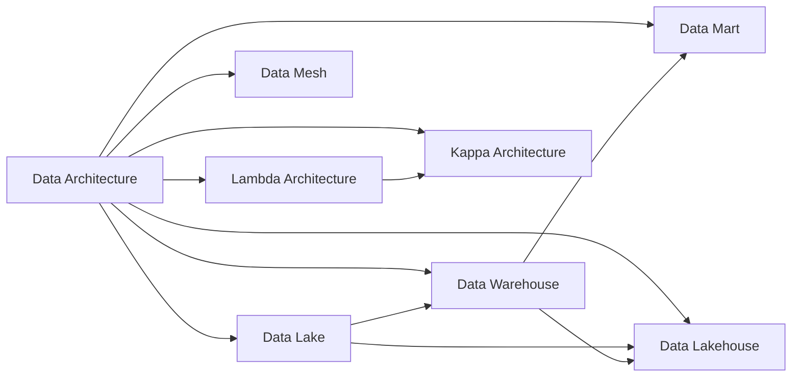

# Data Architecture

Data Architecture describes how data is processed, stored, and utilized in an information system.

## Popular Data Architecture Patterns

- [Data Lake](Data%20Lake.md)
- [Data Lakehouse](Data%20Lakehouse.md)
- [Data Mart](Data%20Mart.md)
- [Data Mesh](Data%20Mesh.md)
- [Data Warehouse](Data%20Warehouse.md)
- [Lambda Architecture](Lambda%20Architecture.md)
- [Kappa Architecture](Kappa%20Architecture.md)

## Data Architecture Examples

- [AWS Reference Architecture Examples](https://aws.amazon.com/architecture/reference-architecture-diagrams/)
- [Azure Architecture Examples](https://learn.microsoft.com/en-us/azure/architecture/browse/)
- [GCP Architecture Center](https://cloud.google.com/architecture)

## Knowledge Graph Connections

## Related Concepts

- **Data Lake**: Flexible storage for massive amounts of raw data
- **Data Lakehouse**: Unified architecture combining lake and warehouse benefits
- **Data Warehouse**: Central repository for reporting and analytics
- **Data Mesh**: Domain-oriented, decentralized data architecture
- **Data Mart**: Subject-specific segment of a data warehouse
- **Lambda Architecture**: Batch + real-time processing pattern
- **Kappa Architecture**: Stream-only processing pattern

---

**Source**: [Data Engineering Wiki](https://dataengineering.wiki/Concepts/Data+Architecture/Data+Architecture)
