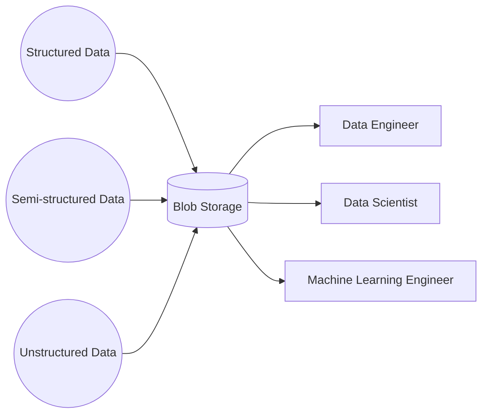
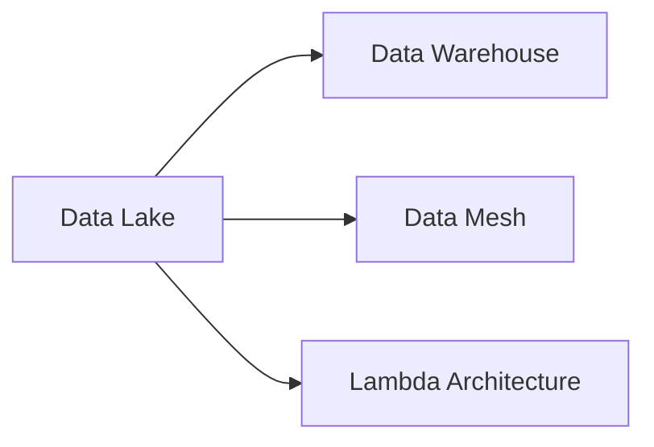

# Data Lake

A data lake is a flexible storage pattern that is typically used for storing massive amounts of raw data in its native format. Data lakes are flexible in that they can store practically any type of data from structured (tabular data), semi-structured (JSON, XML), and unstructured data (videos, images, audio). Data lakes utilize blob storage which is a cheap and abundant and a compute engine of the user's choice.

## Data Lake Advantages

- Cheaply store large amounts of data
- Flexibly store any type of data (futureproof)
- Allows for compute optimization by mixing and matching compute options for different workloads
- All data is stored in one place where all stakeholders can work

## Data Lake Disadvantages

- Data governance is more challenging and relies on robust cataloging and metadata to make the data useful. Cloud providers often offer additional services to address these issues.
- Because storage is cheap, there's a tendency to store more data regardless of its business value.

## Data Lake Reference Architectures

- **AWS**: [Deploy and manage a serverless data lake on the AWS Cloud](https://docs.aws.amazon.com/prescriptive-guidance/latest/patterns/deploy-and-manage-a-serverless-data-lake-on-the-aws-cloud-by-using-infrastructure-as-code.html)
- **Azure**: [Introduction to Azure Data Lake Storage Gen2](https://learn.microsoft.com/en-us/training/modules/introduction-to-azure-data-lake-storage/)
- **GCP**: [Data lakes in cloud with Kafka and Confluent](https://cloud.google.com/blog/products/data-analytics/data-lakes-in-cloud-with-kafka-and-confluent)

## Knowledge Graph Connections

**Related Patterns**:
- Can evolve into a [Data Warehouse](Data%20Warehouse.md) with proper structure
- Can be the foundation for [Data Mesh](Data%20Mesh.md) implementation
- Often used with [Lambda Architecture](Lambda%20Architecture.md) and [Kappa Architecture](Kappa%20Architecture.md)

---

**Source**: [Data Engineering Wiki](https://dataengineering.wiki/Concepts/Data+Architecture/Data+Lake)
