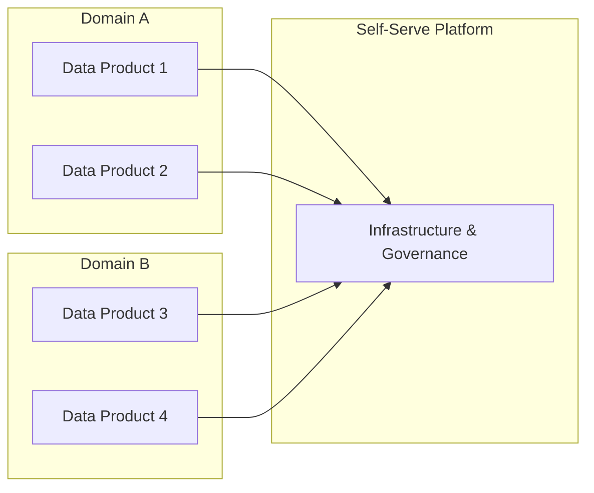
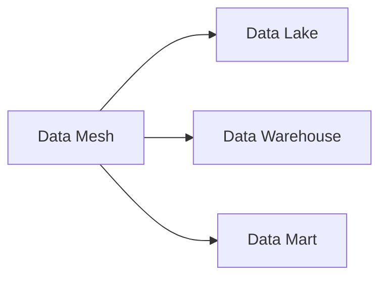

# Data Mesh

Data Mesh is an analytical data architecture and operating model where data is treated as a product, leveraging a domain-driven and self-serve design.

## The Four Principles of Data Mesh

1. **Domain Ownership**: Arranging Data in Domains and declaring full end-to-end ownership
2. **Data as a Product**: Applying Product-thinking to Data Assets and bridging the gap between Producers and Consumers
3. **Self-serve Data Platform**: Removing the intricacies of Infrastructure provisioning to enable domain autonomy and shorten lifecycles
4. **Federated Computational Governance**: Seeking interoperability through global standardization

## Data Mesh Advantages

- Better Data Governance
- Improved Data Quality
- Data Products are built thinking on the consumer's needs first
- Fine-grained Access by Domain

## Data Mesh Disadvantages

- The decentralization of data is challenging. It requires changes not only technically, but also at organizational and mindset levels.

## Knowledge Graph Connections

**When to Use Data Mesh**:
- Organizations with multiple domains
- Scaling beyond centralized data teams
- When domain expertise is distributed
- For faster iteration on data products

---

**Source**: [Data Engineering Wiki](https://dataengineering.wiki/Concepts/Data+Architecture/Data+Mesh)
