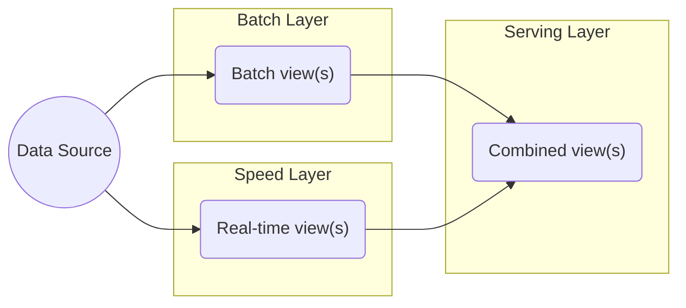
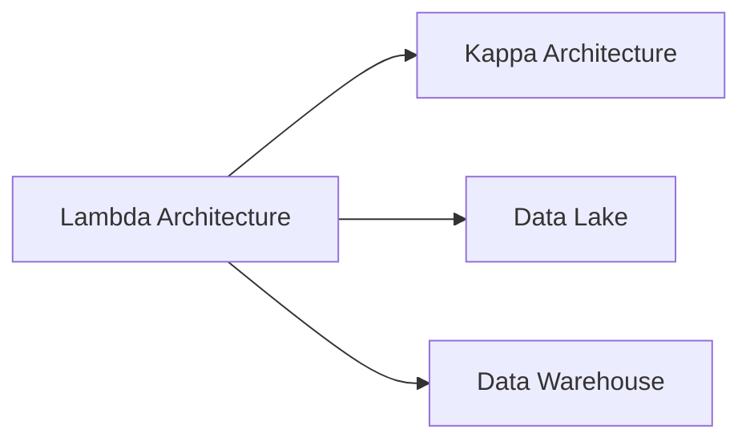

# Lambda Architecture

Lambda architecture is a data processing pattern designed to strike a balance between low latency, high throughput, and fault tolerance. This architecture type uses a combination of batch processing to create accurate views of large data sets and real-time stream processing to provide views of live data. The results from both sets can then be merged and presented together.

## Lambda Architecture Advantages

- Efficiently serves batch and real-time workloads
- Fault tolerance through batch layer
- Scalable for large data volumes

## Lambda Architecture Disadvantages

- Duplicated code/logic for both batch and real-time views
- Complex to maintain and operate
- Higher operational overhead

## Lambda Architecture Components

1. **Batch Layer**: Stores the master dataset and precomputes batch views
2. **Speed Layer**: Processes real-time data and compensates for batch layer's high latency
3. **Serving Layer**: Merges batch and real-time views for queries

## Learning Resources

- [How to Beat the CAP Theorem](http://nathanmarz.com/blog/how-to-beat-the-cap-theorem.html)
- [Questioning the Lambda Architecture](http://radar.oreilly.com/2014/07/questioning-the-lambda-architecture.html)

## Knowledge Graph Connections

**Evolution**:
- [Kappa Architecture](Kappa%20Architecture.md) was created to address Lambda's complexity
- Often implemented with [Data Lakes](Data%20Lake.md) as the storage layer

---

**Source**: [Data Engineering Wiki](https://dataengineering.wiki/Concepts/Data+Architecture/Lambda+Architecture)
