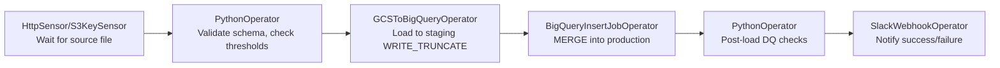
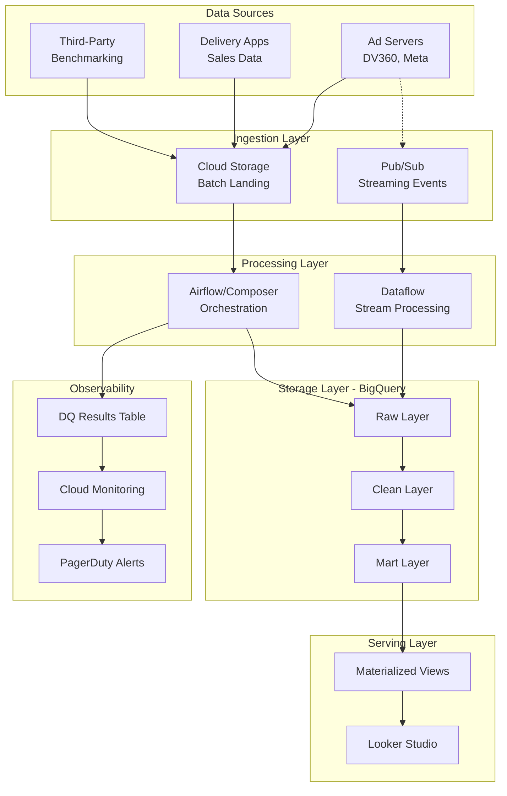

# Interview Prep: Senior Data Engineer – AdTech

> [!abstract] Overview
> Comprehensive, role-specific Q&A guide for AdTech Data Engineering interviews. Covers behavioral, technical, SQL coding, and system design.

---

## Round Structure to Expect

> [!info] Typical Interview Flow

| Round | Focus | Duration |
|-------|-------|----------|
| **1. Recruiter Screen** | Role fit, availability, CET hours, salary | 30 min |
| **2. Hiring Manager** | Behavioral, ownership mindset, business understanding | 45-60 min |
| **3. Technical** | Python/SQL coding + system design | 60–90 min |
| **4. Bar Raiser / Final** | Technical depth, cross-functional collaboration | 45-60 min |

---

## Behavioral & Ownership Questions

> [!warning] Seniority Assessment
> These test your seniority, proactivity, and business alignment — heavily emphasized in AdTech roles.

### Q1: Tell me about a time you owned a data quality problem end-to-end. What was broken, what did you do, and what was the outcome?

> [!tip] Sample Answer
> At [company], our campaign performance pipeline had **silent failures** — rows were being dropped due to upstream schema changes. I noticed dashboard discrepancies during a product review, traced it to a missing `NULL` guard in the Airflow DAG, added a **Great Expectations validation layer**, and set up **PagerDuty alerts** for SLA breaches.
>
> **Outcome:** Reduced data incidents from ~8/month to ~1/month over the next quarter.

---

### Q2: Describe a project where you had to integrate a new data source with unclear business logic. How did you align with stakeholders?

> [!tip] Sample Answer
> We onboarded a 3rd-party audience segmentation feed. The mapping between their taxonomy and ours was ambiguous.
>
> **Approach:**
> 1. Ran a 3-session "definition workshop" with Product and Analytics teams
> 2. Documented agreed logic in Confluence
> 3. Modeled as a **separate dimension table** so semantic layer stayed clean
> 4. Built a **reconciliation job** to flag records where coverage fell below 80%

---

### Q3: How do you prioritize when you have multiple pipeline failures, a new data source to integrate, and a dashboard SLA due the same day?

> [!success] Triage Framework
>
> | Priority | Task | Rationale |
> |----------|------|-----------|
> | **1st** | SLA breach | External impact, customer-facing |
> | **2nd** | Pipeline hotfix | Internal impact, quick resolution |
> | **3rd** | New integration | Defer or delegate |
>
> **Key:** Communicate proactively to stakeholders about timeline adjustments.

---

## BigQuery & GCP Technical Questions

> [!info] Core Technical Focus
> These are fundamental to AdTech data engineering roles.

### Q4: How do you optimize a slow BigQuery query on a large campaign impressions table?

> [!tip] Optimization Steps
>
> 1. **Check execution plan** — Use `INFORMATION_SCHEMA` or query plan visualizer
> 2. **Partitioning** — On `event_date` to prune scans (critical for time-series ad data)
> 3. **Clustering** — On `campaign_id` and `ad_group_id` for common filters
> 4. **Avoid `SELECT *`** — Scan only needed columns
> 5. **Replace correlated subqueries** — Use `WITH` CTEs or window functions
> 6. **Use approximate functions** — `APPROX_COUNT_DISTINCT` instead of `COUNT(DISTINCT)` on huge sets

---

### Q5: What's the difference between partitioning and clustering in BigQuery?

> [!success] Key Distinction
>
> | Feature | Partitioning | Clustering |
> |---------|--------------|------------|
> | **What it does** | Divides table into segments by column | Sorts data within partitions |
> | **Best for** | Time-range queries | Filter and join performance |
> | **Example** | Partition by `date` | Cluster by `campaign_id, advertiser_id` |

> [!example] AdTech Pattern
> For an ad impressions table:
> - **Partition by:** `date` (for time-range queries)
> - **Cluster by:** `campaign_id, advertiser_id` (common filter fields)

---

### Q6: How do you handle schema evolution in BigQuery?

> [!info] Answer
>
> **Backward-Compatible Changes:**
> - Add new nullable columns (supported natively)
> - BigQuery supports column additions without breaking
>
> **Breaking Changes:**
> - Version the table (e.g., `impressions_v2`)
> - Run migration DAG in Airflow
> - Enforce schema contracts using **dbt tests** or custom Python validators

---

### Q7: Design a cost-efficient BigQuery pipeline for daily CPG campaign data

> [!tip] Cost Optimization Strategy
>
> | Aspect | Recommendation |
> |--------|----------------|
> | **Ingestion** | Batch via Cloud Storage → GCS → BQ load jobs (cheaper than streaming) |
> | **Dashboards** | Materialized views for heavy queries |
> | **Compute** | Slot reservations for predictable workloads |
> | **Timing** | Scheduled queries during off-peak hours |

---

## Airflow / Pipeline Design Questions

### Q8: How do you ensure SLA reliability in an Airflow DAG?

> [!success] SLA Framework
>
> ```python
> # Key configurations
> task = PythonOperator(
>     task_id='critical_task',
>     sla=timedelta(hours=2),  # SLA threshold
>     execution_timeout=timedelta(minutes=30),
>     retries=3,
>     retry_delay=timedelta(minutes=5),
>     email_on_failure=True,
>     on_failure_callback=alert_callback
> )
> ```

**Monitoring Stack:**
- `sla` parameters on critical tasks
- `email_on_failure` + `on_failure_callback` → Slack/PagerDuty
- `execution_timeout` to kill zombie tasks
- Exponential backoff with `retries` and `retry_delay`
- Upstream health checks as sensors
- DAG lag monitoring via Grafana dashboard

---

### Q9: Design an Airflow DAG for daily audience segmentation data ingestion



> [!info] DAG Structure
> 1. **Sensor** — Wait for source file availability
> 2. **Validation** — Schema check, row count thresholds (Great Expectations)
> 3. **Load** — Stage table with `WRITE_TRUNCATE`
> 4. **Merge** — Production table with upsert logic
> 5. **DQ Checks** — Null rates, range checks
> 6. **Notification** — Slack alert on completion

---

### Q10: How do you handle a DAG that fails halfway through a multi-step pipeline?

> [!tip] Idempotency Design
>
> | Principle | Implementation |
> |-----------|----------------|
> | **Safe re-runs** | Each task should be idempotent |
> | **Staging tables** | Use `WRITE_TRUNCATE` |
> | **Production tables** | Use `MERGE` for upserts |
> | **State management** | Prefer external stores (GCS, BQ) over XComs for large payloads |
> | **Recovery** | Enable task-level retries and partial re-runs |

---

## Data Quality & Observability

### Q11: What's your approach to adding observability to a data pipeline?

> [!success] Three-Layer Observability
>
> ```mermaid
> graph TB
>     subgraph Pipeline["Pipeline-Level"]
>         A1[Task Status]
>         A2[DAG Run Metrics]
>         A3[Cloud Monitoring]
>     end
>
>     subgraph Data["Data-Level"]
>         B1[Row Count Assertions]
>         B2[Null-Rate Checks]
>         B3[Value Distribution]
>         B4[Great Expectations/dbt]
>     end
>
>     subgraph Business["Business-Level"]
>         C1[Reconciliation Reports]
>         C2[KPI vs Source Totals]
>         C3[Anomaly Detection on CTR/ROAS]
>     end
> ```

---

### Q12: How do you implement data quality checks for a campaign performance dataset?

> [!info] Validation Suite
>
> | Check Type | Examples |
> |------------|----------|
> | **Schema conformance** | Column types match expected |
> | **Completeness** | No nulls on `campaign_id`, `impression_count` |
> | **Freshness** | Latest `event_date` within 25 hours of load |
> | **Referential integrity** | `campaign_id` exists in campaigns dimension |
> | **Value plausibility** | CTR between 0–1, no negative spend |
>
> **Output:** Results written to `dq_results` table, visualized in Looker Studio

---

## SQL Live Coding

> [!warning] Common AdTech Patterns
> Practice these patterns for live coding rounds.

### Q13: Find the top 3 campaigns by total revenue for each advertiser in the last 30 days

```sql
WITH ranked AS (
  SELECT
    advertiser_id,
    campaign_id,
    SUM(revenue) AS total_revenue,
    RANK() OVER (
      PARTITION BY advertiser_id
      ORDER BY SUM(revenue) DESC
    ) AS rk
  FROM campaign_performance
  WHERE event_date >= DATE_SUB(CURRENT_DATE(), INTERVAL 30 DAY)
  GROUP BY advertiser_id, campaign_id
)
SELECT advertiser_id, campaign_id, total_revenue
FROM ranked
WHERE rk <= 3;
```

---

### Q14: Calculate 7-day rolling average CTR per campaign

```sql
SELECT
  campaign_id,
  event_date,
  clicks / NULLIF(impressions, 0) AS daily_ctr,
  AVG(clicks / NULLIF(impressions, 0)) OVER (
    PARTITION BY campaign_id
    ORDER BY event_date
    ROWS BETWEEN 6 PRECEDING AND CURRENT ROW
  ) AS rolling_7d_ctr
FROM campaign_performance
ORDER BY campaign_id, event_date;
```

---

### Q15: Detect campaigns where data is missing for any day in the last 7 days (gap detection)

```sql
WITH date_spine AS (
  SELECT DISTINCT campaign_id, date
  FROM UNNEST(
    GENERATE_DATE_ARRAY(
      DATE_SUB(CURRENT_DATE(), INTERVAL 7 DAY),
      CURRENT_DATE()
    )
  ) AS date
  CROSS JOIN (SELECT DISTINCT campaign_id FROM campaign_performance) c
)
SELECT ds.campaign_id, ds.date
FROM date_spine ds
LEFT JOIN campaign_performance cp
  ON ds.campaign_id = cp.campaign_id
  AND ds.date = cp.event_date
WHERE cp.event_date IS NULL
ORDER BY ds.campaign_id, ds.date;
```

---

## System Design Question

### Q16: Design the Data Insights Platform — Reporting Pipeline for CPG Brands

> [!abstract] Core System Design Question
> This is the primary system design question for AdTech roles. Structure your answer clearly.



#### Ingestion Layer

| Source | Method | Frequency |
|--------|--------|-----------|
| **Campaign data** | Ad servers (DV360, Meta) → GCS | Daily batch |
| **Sales data** | Delivery apps → GCS | Daily batch |
| **Real-time events** | Pub/Sub → Dataflow → BQ | Streaming (optional) |

#### Processing Layer

- **Orchestration:** Airflow DAGs (Cloud Composer)
- **Flow:** Ingest → Validate → Transform → Load
- **Architecture:** Medallion-style (raw / clean / aggregated)

#### Data Model

| Table Type | Example | Partitioning | Clustering |
|------------|---------|--------------|------------|
| **Fact** | `fact_campaign_performance` | By date | campaign_id, advertiser_id |
| **Dimension** | `dim_campaign` | - | - |
| **Dimension** | `dim_advertiser` | - | - |
| **Dimension** | `dim_product_category` | - | - |
| **Dimension** | `dim_audience_segment` | - | - |

#### Serving Layer

- **Materialized views** or scheduled `MERGE` jobs for Looker performance
- **Looker Studio** connects via BigQuery connector
- One data source per brand/region for access control

#### Observability

- `dq_results` table fed by Great Expectations checks
- SLA alerting via Cloud Monitoring + PagerDuty

#### Schema Evolution Strategy

- New sources → new dimension tables
- No destructive changes to existing marts
- Version fields added as nullable columns

---

## AdTech Domain Questions

### Q17: What is ROAS and how would you calculate it in SQL?

> [!info] ROAS (Return on Ad Spend)
>
> **Formula:** `ROAS = Revenue / Ad Spend`
>
> ```sql
> SELECT
>   campaign_id,
>   SUM(revenue) / NULLIF(SUM(spend), 0) AS roas
> FROM campaign_performance
> GROUP BY campaign_id;
> ```
>
> **Interpretation:** ROAS > 1 means the campaign generated more revenue than it cost.

---

### Q18: What's the difference between last-touch and multi-touch attribution?

> [!success] Attribution Models
>
> | Model | How it Works | Best For |
> |-------|--------------|----------|
> | **Last-touch** | 100% credit to final touchpoint | Simple, short journeys |
> | **Multi-touch (MTA)** | Distributes credit across all touchpoints | Cross-platform campaigns |
>
> **MTA Variants:** Linear, Time-decay, Data-driven
>
> > [!warning] For CPG Brands
> > MTA is more accurate but requires joining impression-level data across ad servers. Last-touch is misleading for long purchase journeys.

---

### Q19: How would you integrate a new competitor benchmarking data source?

> [!tip] Integration Approach
>
> 1. **Profile the source** — Schema, update frequency, coverage
> 2. **Model as new dimension** — `dim_category_benchmark` (don't modify existing facts)
> 3. **Build separate DAG** — For ingestion with quality checks
> 4. **Expose as join-able table** — In mart layer
> 5. **Optional for dashboards** — Developers can add without breaking existing reports

---

## Looker Studio–Specific Questions

### Q20: What are common performance bottlenecks in Looker Studio dashboards?

> [!warning] Common Issues & Fixes
>
> | Bottleneck | Cause | Fix |
> |------------|-------|-----|
> | **Raw table queries** | Dashboard hitting raw tables | Use materialized/aggregated tables |
> | **Too many blends** | Multiple blended data sources | Consolidate into single wide mart |
> | **No caching** | Repeated expensive queries | Enable Looker caching, pre-aggregate with scheduled queries |
> | **Partition filter miss** | Date filter not pushing down | Ensure date dimension maps to partition column |

---

## Key Preparation Tips

> [!success] Interview Strategy

### Own the Narrative
- Frame every answer around **delivering reliable, timely insights to CPG advertisers**
- Demonstrate understanding of the business context

### Emphasize Proactivity
- Bring up times you **identified problems before** they were escalated
- Show ownership mindset

### Prepare STAR Stories

| Topic | Example Focus |
|-------|---------------|
| **SLA incident** | How you detected, resolved, and prevented recurrence |
| **New data source** | Stakeholder alignment, schema negotiation, integration |
| **Cross-team alignment** | Business logic disputes, documentation, governance |
| **Dashboard optimization** | Performance diagnosis, solution implementation |

### Know Your AdTech Metrics

| Metric | Formula | Meaning |
|--------|---------|---------|
| **CTR** | Clicks / Impressions | Click-through rate |
| **CPM** | Cost / Impressions × 1000 | Cost per thousand impressions |
| **CPA** | Cost / Conversions | Cost per acquisition |
| **ROAS** | Revenue / Spend | Return on ad spend |
| **Viewability** | Viewable Impressions / Total | Ad visibility rate |
| **Frequency Capping** | Impressions / Unique Users | Ad exposure control |

### Practice SQL Patterns

- ✅ Window functions (`RANK`, `ROW_NUMBER`, `LAG/LEAD`)
- ✅ Rolling aggregates
- ✅ Gap detection with date spines
- ✅ `MERGE` statements in BigQuery syntax
- ✅ `NULLIF` for safe division
- ✅ `APPROX_COUNT_DISTINCT` for performance

---

## Leaked Interview Problems — Round 1

> [!danger] Actual Interview Questions
> These are leaked problems from real AdTech interviews. Practice these patterns thoroughly.

### SQL Q1 — Employee Count & Budget Per Project

> [!info] Problem
> Count employees assigned to each project using the **bridge table** for many-to-many relationships.

**Schema:**
```sql
-- employees        (id, department_id, salary)
-- projects         (id, title, budget, employee_id)
-- departments      (id, name)
-- employee_projects(employee_id, project_id)  ← many-to-many bridge
```

**Solution:**
```sql
SELECT
    p.title                    AS project_title,
    p.budget                   AS project_budget,
    COUNT(ep.employee_id)      AS employee_count
FROM projects p
LEFT JOIN employee_projects ep ON p.id = ep.project_id
GROUP BY p.id, p.title, p.budget
ORDER BY p.title;
```

> [!tip] Key Insights
> - **Use `LEFT JOIN`** — Projects with zero employees still appear
> - **Count nullable column** — `COUNT(ep.employee_id)` returns 0 for empty projects (not NULL)
> - **Don't use `COUNT(*)`** — Would return 1 for empty projects

---

### SQL Q2 — Salary Difference vs Department Average

> [!info] Problem
> Calculate each employee's salary difference from their department average.

**Solution:**
```sql
SELECT
    e.id                                                         AS employee_id,
    e.department_id,
    e.salary,
    ROUND(AVG(e.salary) OVER (PARTITION BY e.department_id), 2) AS dept_avg_salary,
    ROUND(e.salary - AVG(e.salary) OVER (PARTITION BY e.department_id), 2) AS salary_diff
FROM employees e
ORDER BY e.department_id, salary_diff DESC;
```

> [!success] Talking Points
> - **Window function** — Cleaner than CTE + self-join approach
> - **Positive salary_diff** — Employee earns above department average
> - **Negative salary_diff** — Employee earns below department average
> - **Alternative** — CTE with `GROUP BY` then `JOIN` back, but window is more elegant

---

### Python Q1 — Count Unique Elements

> [!info] Problem
> Count unique elements in an array.

**Solution:**
```python
def count_unique(arr):
    return len(set(arr))

# Examples
count_unique([1, 2, 2, 3, 3, 3, 4])        # → 4
count_unique(["a", "b", "a", "c", "b"])     # → 3
```

> [!tip] Complexity
> - **Time:** O(n)
> - **Space:** O(n)
>
> If asked for no-built-ins version, use dict or manual loop — but `set` is always the correct answer.

---

### Python Q2 — Flat JSON snake_case → camelCase

> [!info] Problem
> Convert flat JSON keys from snake_case to camelCase.

**Solution:**
```python
def snake_to_camel(snake: str) -> str:
    parts = snake.split("_")
    return parts[0] + "".join(word.capitalize() for word in parts[1:])

def convert_keys_to_camel(data: dict) -> dict:
    return {snake_to_camel(k): v for k, v in data.items()}

# Input
{"first_name": "Alice", "employee_id": 42}
# Output
{"firstName": "Alice", "employeeId": 42}
```

---

### Python Q3 — Nested JSON snake_case → camelCase

> [!info] Problem
> Extend Q2 with recursion to handle nested dicts and lists.

**Solution:**
```python
def convert_keys_to_camel_nested(data):
    if isinstance(data, dict):
        return {
            snake_to_camel(k): convert_keys_to_camel_nested(v)
            for k, v in data.items()
        }
    elif isinstance(data, list):
        return [convert_keys_to_camel_nested(item) for item in data]
    else:
        return data  # primitive value — return unchanged
```

**Example Output:**
```json
{
  "campaignId": 101,
  "campaignName": "Summer Sale",
  "adGroupDetails": {
    "adGroupId": 5,
    "targetAudience": "young_adults",
    "bidStrategy": { "maxCpc": 2.5, "dailyBudget": 100 }
  },
  "audienceSegments": [
    { "segmentId": 1, "segmentName": "lapsed_buyers" },
    { "segmentId": 2, "segmentName": "high_value_users" }
  ]
}
```

> [!tip] Key Design Choice
> The three-branch `isinstance` check:
> - `dict` → recurse on keys
> - `list` → recurse on items
> - `else` → return unchanged (primitive)
>
> Values are left untouched — only keys are transformed.

---

### Edge Cases to Mention

> [!warning] Interview Edge Cases

| Problem | Edge Case | How to Handle |
|---------|-----------|---------------|
| **SQL Q1** | Project with no employees | `LEFT JOIN` returns 0, not NULL |
| **SQL Q2** | Department with only 1 employee | `salary_diff = 0`, mathematically correct |
| **Python Q1** | Empty array | `set([]) → len = 0`, safe |
| **Python Q2** | Key with no underscores (e.g., "id") | `parts[0]` alone → "id" unchanged ✓ |
| **Python Q3** | List of primitives (e.g., `[1, 2, 3]`) | `else: return data` handles correctly |
| **Python Q3** | Deeply nested (5+ levels) | Recursion handles arbitrary depth; for extreme cases, mention iterative stack-based alternative to avoid Python recursion limits |

---

## Related Notes

- [[BigQuery Interview Questions]]
- [[dbt Interview Questions]]
- [[SQL Interview Questions]]
- [[System Design Framework]]
- [[Behavioral Interview Questions]]

---

> [!quote] Source
> AdTech Interview Prep compiled from Perplexity research and industry best practices.
