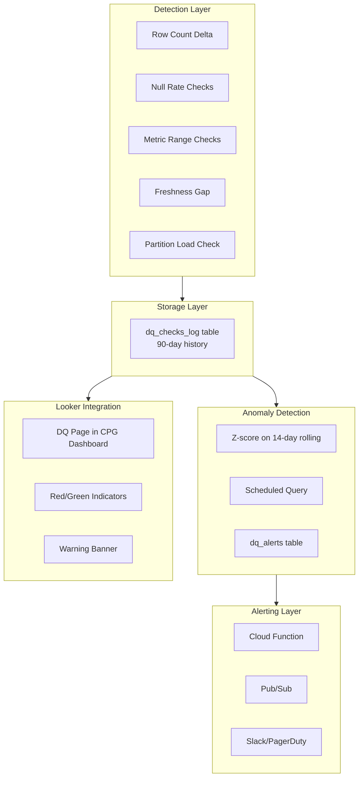

# Variant 2 — Technical Deep Dive Round

> [!abstract] Round Overview
> Simulates the **Bar Raiser / Senior Technical Round** (~90 min). Focuses on Python engineering, advanced BigQuery, Airflow internals, and harder system design questions.

---

## Python Engineering Questions

### Q1: Write a Python decorator that adds retry logic with exponential backoff

> [!tip] Tests production-grade Python, not just syntax

```python
import time
import functools
import logging

def retry(max_attempts=3, base_delay=2, exceptions=(Exception,)):
    def decorator(func):
        @functools.wraps(func)
        def wrapper(*args, **kwargs):
            for attempt in range(1, max_attempts + 1):
                try:
                    return func(*args, **kwargs)
                except exceptions as e:
                    if attempt == max_attempts:
                        logging.error(
                            f"[{func.__name__}] Failed after {max_attempts} attempts: {e}"
                        )
                        raise
                    delay = base_delay ** attempt
                    logging.warning(
                        f"[{func.__name__}] Attempt {attempt} failed. Retrying in {delay}s..."
                    )
                    time.sleep(delay)
        return wrapper
    return decorator

# Usage in a pipeline
@retry(max_attempts=4, base_delay=2, exceptions=(ConnectionError, TimeoutError))
def fetch_audience_segments(api_url: str) -> dict:
    # HTTP call to segmentation API
    ...
```

> [!question] Follow-up
> "How would you make this async-safe?" → Use `asyncio.sleep` instead of `time.sleep` and wrap with `async def`.

---

### Q2: Ingest, validate, and route invalid records to dead-letter bucket

> [!info] Scenario
> Daily JSON feed of campaign events. Some records have missing `advertiser_id`. Write a class to handle validation and dead-letter routing.

```python
from dataclass import dataclass, field
from typing import List, Dict
from google.cloud import storage
import json
import logging

@dataclass
class CampaignEventIngester:
    valid_records: List[Dict] = field(default_factory=list)
    invalid_records: List[Dict] = field(default_factory=list)

    REQUIRED_FIELDS = {"campaign_id", "advertiser_id", "event_date", "impressions"}

    def validate(self, record: Dict) -> bool:
        missing = self.REQUIRED_FIELDS - record.keys()
        if missing or not record.get("advertiser_id"):
            record["_error"] = f"Missing fields: {missing or 'advertiser_id is null'}"
            return False
        return True

    def process(self, records: List[Dict]):
        for r in records:
            (self.valid_records if self.validate(r) else self.invalid_records).append(r)
        logging.info(
            f"Valid: {len(self.valid_records)}, Invalid: {len(self.invalid_records)}"
        )

    def write_dead_letter(self, bucket_name: str, blob_name: str):
        client = storage.Client()
        blob = client.bucket(bucket_name).blob(blob_name)
        blob.upload_from_string(
            json.dumps(self.invalid_records, default=str),
            content_type="application/json"
        )
        logging.info(f"Dead-letter written to gs://{bucket_name}/{blob_name}")
```

> [!success] Key Highlights
> - Separation of validation from I/O
> - Dead-letter pattern for observability
> - Invalid records don't block the pipeline

---

### Q3: How do you handle late-arriving data in a daily campaign pipeline?

> [!tip] Reprocessing Window Approach
>
> | Strategy | Implementation |
> |----------|----------------|
> | **Open partitions** | Keep partitions "open" for N days |
> | **Use MERGE** | Late records update existing rows (no duplicates) |
> | **Track lateness** | `ingested_at` vs `event_date` metrics |
> | **Dashboard visibility** | Expose `data_freshness_ts` field |
> | **Alerting** | If lateness > 48h, alert and route to reconciliation table |

---

## Advanced BigQuery Questions

### Q4: What is slot contention and how do you diagnose/fix it?

> [!info] Answer
>
> **What are Slots?** Units of compute in BigQuery.
>
> | Mode | Behavior |
> |------|----------|
> | **On-demand** | Auto-scales but can queue under heavy load |
> | **Reservations** | Fixed slots, predictable capacity |

**Diagnosis:**
- Query `INFORMATION_SCHEMA.JOBS_BY_PROJECT` for high `total_slot_ms`
- Check `INFORMATION_SCHEMA.RESERVATION_CHANGES_BY_PROJECT`

**Fixes:**
- Move heavy batch jobs to off-peak hours
- Use flat-rate reservations for predictable workloads
- Break fan-out joins into smaller CTEs
- Avoid `CROSS JOIN` on large tables

---

### Q5: Explain columnar storage for a 50+ column impressions table

> [!success] Capacitor Format
>
> BigQuery uses **Capacitor**, a columnar format where queries only read referenced columns.
>
> **Example:**
> ```sql
> SELECT campaign_id, impressions FROM fact_impressions
> ```
> Scans **2 columns** regardless of table width.
>
> **Impact:**
> - 50-column table, dashboards query 6–8 columns
> - **~85% less data scanned** vs row-based storage
> - Directly reduces cost and latency

---

### Q6: Attribution Problem — Linear Multi-Touch Model

> [!info] Scenario
> User saw ads from 3 campaigns before purchasing. Assign credit using linear MTA.

```sql
WITH user_touchpoints AS (
  SELECT
    user_id,
    campaign_id,
    event_ts,
    COUNT(*) OVER (PARTITION BY user_id) AS total_touches
  FROM ad_exposures
  WHERE user_id IN (SELECT user_id FROM conversions)
    AND event_ts < (
      SELECT MIN(converted_at)
      FROM conversions c
      WHERE c.user_id = ad_exposures.user_id
    )
),
conversion_value AS (
  SELECT user_id, revenue FROM conversions
)
SELECT
  t.campaign_id,
  SUM(cv.revenue / t.total_touches) AS attributed_revenue,
  COUNT(DISTINCT t.user_id) AS attributed_users
FROM user_touchpoints t
JOIN conversion_value cv USING (user_id)
GROUP BY t.campaign_id
ORDER BY attributed_revenue DESC;
```

> [!tip] Key Talking Point
> `total_touches` distributes revenue equally. For time-decay, replace `1/total_touches` with a decay weight based on recency.

---

## Advanced Airflow Questions

### Q7: What are Dynamic DAGs and when would you use them?

> [!tip] Answer
> Dynamic DAGs generate tasks at runtime from external config — e.g., one DAG template that spawns a separate pipeline per CPG brand.

**Use Case:** As new brands onboard, use a YAML config in GCS that the DAG reads at parse time to create brand-specific tasks.

```python
# Dynamic task generation per advertiser
import yaml
from airflow import DAG
from airflow.operators.python import PythonOperator

with open("/gcs/config/advertisers.yaml") as f:
    advertisers = yaml.safe_load(f)["advertisers"]

with DAG("campaign_etl_dynamic", schedule_interval="@daily") as dag:
    for advertiser in advertisers:
        PythonOperator(
            task_id=f"process_{advertiser['id']}",
            python_callable=run_pipeline,
            op_kwargs={"advertiser_id": advertiser["id"]}
        )
```

**Benefits:**
- Avoids copy-paste DAGs
- Makes onboarding self-service

---

### Q8: Prevent cascading DAG failures in Data Insights Platform

> [!success] Bulkhead Isolation Strategy
>
> | Technique | Implementation |
> |-----------|----------------|
> | **Isolated DAGs** | Each brand's pipeline runs independently |
> | **Retry isolation** | Brand A failure doesn't block Brand B |
> | **max_active_runs=1** | Prevent parallel run overlap |
> | **trigger_rule** | `ALL_DONE` on cleanup tasks |
> | **Circuit-breaker** | If source rows drop >30% vs 7-day avg, halt and alert |

---

## System Design — DQ Monitoring System

### Q9: Design a data quality monitoring system that auto-detects anomalies and alerts before dashboard refresh



### Detection Layer

| Check Type | Description |
|------------|-------------|
| **Row count delta** | Compare to previous runs |
| **Null rate** | Per critical column |
| **Metric range** | CTR 0–1, spend > 0 |
| **Freshness gap** | Latest partition timestamp |
| **Partition check** | Use `INFORMATION_SCHEMA.PARTITIONS` |

### Storage

```sql
-- dq_checks_log schema
CREATE TABLE dq_checks_log (
  check_id STRING,
  table_name STRING,
  metric STRING,
  expected FLOAT64,
  actual FLOAT64,
  status STRING,
  run_ts TIMESTAMP
);
```

### Anomaly Detection

- **Z-score:** Flag if `|actual - mean| > 2σ` on rolling 14-day history
- **Scheduled query:** Runs post-load, writes to `dq_alerts`

### Alerting

- Cloud Function triggered by new `dq_alerts` rows
- Pub/Sub → Slack/PagerDuty
- Alert includes: metric name, expected vs actual, affected advertiser, dashboard link

### Looker Studio Integration

- Add "Data Quality" page to each CPG dashboard
- Red/green indicators per table
- Critical check failure → banner: *"Data for [brand] may be incomplete as of [date]"*

---

## Quick Reference: Variant 2 Focus Areas

> [!abstract] Key Differentiators
>
> | Area | Focus |
> |------|-------|
> | **Python** | Production-grade (decorators, classes, dead-letter) |
> | **BigQuery** | Internals (slots, columnar, attribution SQL) |
> | **Airflow** | Dynamic DAGs, bulkhead isolation |
> | **System Design** | DQ monitoring architecture |
> | **SQL Difficulty** | Hard (attribution, multi-touch) |

---

## Related Notes

- [[AdTech Interview Prep - Variant 1]]
- [[AdTech Interview Prep - Variant 3]]
- [[BigQuery Interview Questions]]
- [[Python Interview Questions]]

---

> [!quote] Source
> AdTech Technical Deep Dive Round — Bar Raiser preparation.
