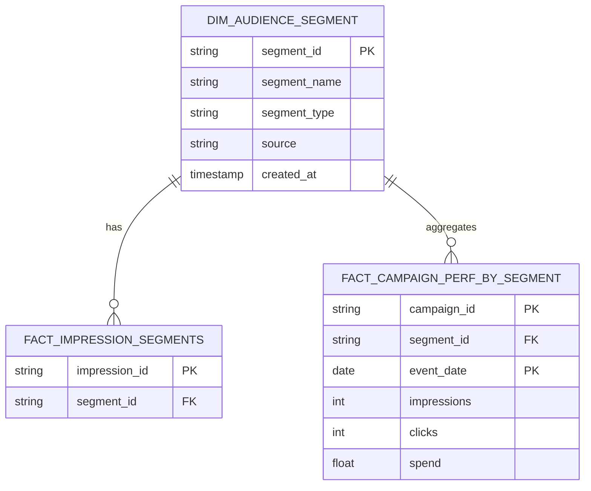
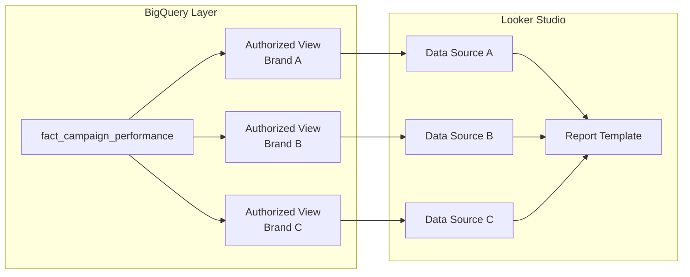
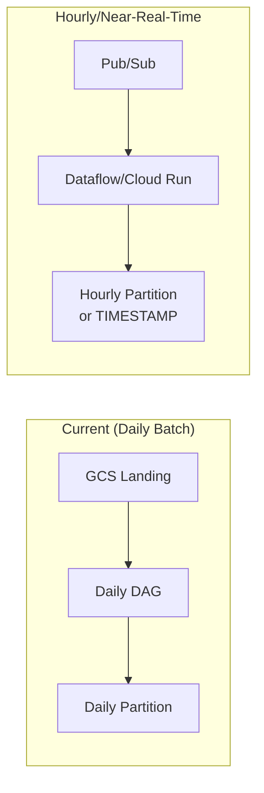

# Variant 3 — Hiring Manager / Business Logic Round

> [!abstract] Round Overview
> Simulates a **collaborative, less-coded round** (~60 min). Focuses on ownership, cross-functional judgment, business logic design, and stakeholder communication.

---

## Ownership & Proactivity

### Q1: You discover ROAS has been calculated incorrectly for 3 months. CPG clients made budget decisions based on it. What do you do?

> [!success] STAR Response
>
> **Situation:** Identified during a data review that revenue was being double-counted due to a JOIN fan-out on the `order_items` table.
>
> **Task:** Fix the metric, communicate impact, and restore trust.
>
> **Action:**
> 1. **Quantified the error** — ROAS was overstated by ~18% on average
> 2. **Drafted impact assessment** — Affected advertisers and date ranges
> 3. **Fixed the SQL** — Added `DISTINCT` dedup and regression test
> 4. **Coordinated communication** — Worked with Product and Account Management on proactive disclosure
> 5. **Added sanity check** — Daily DQ suite comparing ROAS to historical baseline
>
> **Result:** Rebuilt trust through transparency. Clients appreciated proactive disclosure. Implemented quarterly "metric definition review" process.

---

### Q2: Product asks for "viewability rate" by next sprint. The 3rd-party vendor has inconsistent schema. How do you handle it?

> [!tip] Push Back on Timeline, Not Feature

**Approach:**
1. **Spend 2 days profiling** — Schema consistency, null rates, update frequency, coverage gaps by region
2. **Present realistic estimate** with two options:
   - **(A) Fast path** — Surface raw viewability with "beta" label and known caveats
   - **(B) Quality path** — Full validation + backfill, takes 2 more sprints

**Recommendation:** Option (A) to unblock Product while (B) runs in parallel. Add viewability to DQ monitoring from day one.

---

### Q3: CPG brand's dashboard numbers don't match their ad platform (e.g., Meta Ads Manager). How do you investigate?

> [!info] Data Reconciliation Investigation

| Step | Action |
|------|--------|
| **1** | Confirm date range, timezone, and metric definition on both sides (attribution window, currency) |
| **2** | Check ingestion log — was yesterday's Meta feed ingested completely? |
| **3** | Compare row counts: our fact table vs. expected from Meta's delivery report |
| **4** | Check deduplication differences — Meta may count events our model deduplicates |
| **5** | Escalate to vendor API if feed gap confirmed |

**Documentation:** Create "reconciliation note" attached to dashboard. Set up daily job flagging discrepancies > 5% automatically.

---

## Business Logic & Data Modeling

### Q4: How would you model audience segmentation data for pipeline filtering AND dashboard breakdowns?

> [!success] Dimensional Model Design



**Tables:**

| Table | Purpose |
|-------|---------|
| `dim_audience_segment` | Master segment definitions |
| `fact_impression_segments` | Bridge table (many-to-many) |
| `fact_campaign_performance_by_segment` | Pre-aggregated for dashboards |

**Benefits:**
- Add new segment sources without changing fact table schema
- Dashboards can filter by segment type (e.g., "competitor visitors", "lapsed buyers")
- No raw joins needed in production queries

---

### Q5: Integrate monthly "competitor benchmarks" without breaking existing dashboards

> [!tip] Additive-Only Integration

| Principle | Implementation |
|-----------|----------------|
| **New table** | `dim_category_benchmark` — don't modify existing facts |
| **Optional blend** | New Looker Studio blended source, existing views untouched |
| **Parallel validation** | 3-month comparison against internal aggregates |
| **Version tracking** | `source_version` field for traceability |

---

## Looker Studio / Dashboard Depth

### Q6: How do you support external CPG clients with different data access permissions on the same dashboard?

> [!success] Row-Level Security Architecture



**Approaches:**

| Method | How It Works |
|--------|--------------|
| **Authorized Views** | Each advertiser gets view filtered by `advertiser_id` |
| **Dynamic RLS** | Use `SESSION_USER()` filter in BigQuery with viewer credentials |
| **Separate data sources** | Configure Looker Studio data source per authorized view |

**Key Point:** Clients physically cannot see other brands' data even if they probe the underlying BQ connector.

---

### Q7: What would you change to support near-real-time (hourly) campaign updates?

> [!warning] Real-Time Architecture Trade-offs



**Required Changes:**

| Component | Change |
|-----------|--------|
| **Ingestion** | Replace GCS batch with Pub/Sub + Dataflow (micro-batches) |
| **Partitioning** | Switch to hourly or `TIMESTAMP` partition with 1-hour granularity |
| **Airflow** | Change to `@hourly` schedule, idempotent `MERGE` on `(campaign_id, hour_ts)` |
| **Looker Studio** | Enable 15-minute cache refresh, add "last updated" timestamp |
| **Cost** | Streaming inserts ~10x more expensive than batch |

> [!tip] Recommendation
> Propose **4-hour refresh** as cost-effective middle ground unless business case justifies real-time.

---

## Advanced SQL — Business Logic

### Q8: Identify advertisers whose CTR dropped >20% vs their own 7-day average

```sql
WITH daily_ctr AS (
  SELECT
    advertiser_id,
    event_date,
    SUM(clicks) / NULLIF(SUM(impressions), 0) AS ctr
  FROM campaign_performance
  WHERE event_date >= DATE_SUB(CURRENT_DATE(), INTERVAL 14 DAY)
  GROUP BY advertiser_id, event_date
),
windowed AS (
  SELECT
    advertiser_id,
    event_date,
    ctr,
    AVG(ctr) OVER (
      PARTITION BY advertiser_id
      ORDER BY event_date
      ROWS BETWEEN 7 PRECEDING AND 1 PRECEDING
    ) AS prev_7d_avg_ctr
  FROM daily_ctr
)
SELECT
  advertiser_id,
  event_date,
  ROUND(ctr, 4) AS today_ctr,
  ROUND(prev_7d_avg_ctr, 4) AS prev_avg_ctr,
  ROUND((ctr - prev_7d_avg_ctr) / NULLIF(prev_7d_avg_ctr, 0) * 100, 2) AS pct_change
FROM windowed
WHERE event_date = CURRENT_DATE()
  AND (ctr - prev_7d_avg_ctr) / NULLIF(prev_7d_avg_ctr, 0) < -0.20
ORDER BY pct_change ASC;
```

---

### Q9: Find campaigns in top 10 by spend but NOT top 10 by ROAS (budget efficiency outliers)

```sql
WITH spend_rank AS (
  SELECT
    campaign_id,
    SUM(spend) AS total_spend,
    RANK() OVER (ORDER BY SUM(spend) DESC) AS spend_rk
  FROM campaign_performance
  WHERE event_date >= DATE_SUB(CURRENT_DATE(), INTERVAL 30 DAY)
  GROUP BY campaign_id
),
roas_rank AS (
  SELECT
    campaign_id,
    SUM(revenue) / NULLIF(SUM(spend), 0) AS roas,
    RANK() OVER (ORDER BY SUM(revenue) / NULLIF(SUM(spend), 0) DESC) AS roas_rk
  FROM campaign_performance
  WHERE event_date >= DATE_SUB(CURRENT_DATE(), INTERVAL 30 DAY)
  GROUP BY campaign_id
)
SELECT
  s.campaign_id,
  s.total_spend,
  s.spend_rk,
  r.roas,
  r.roas_rk
FROM spend_rank s
JOIN roas_rank r USING (campaign_id)
WHERE s.spend_rk <= 10 AND r.roas_rk > 10
ORDER BY s.spend_rk;
```

---

## Variant Comparison Cheat Sheet

> [!abstract] Key Differences Between Variants

| Dimension | Variant 1 (Original) | Variant 2 (Bar Raiser) | Variant 3 (HM Round) |
|-----------|---------------------|------------------------|---------------------|
| **Focus** | Foundations + broad coverage | Advanced Python, BQ internals, hard system design | Business judgment, ownership, stakeholder scenarios |
| **SQL Difficulty** | Medium (window functions, gaps) | Hard (attribution, multi-touch) | Hard (anomaly detection, outliers) |
| **Python Depth** | Conceptual | Production-grade (decorators, classes, dead-letter) | Minimal coding, more design discussion |
| **System Design** | Platform overview | DQ monitoring system | Real-time migration trade-offs |
| **Behavioral Weight** | Low | Low | **High** |

---

## Preparation Tips for Hiring Manager Round

> [!success] Key Strategies

### Ownership Mindset
- Frame answers around **proactive problem-solving**
- Show you identify issues before escalation
- Demonstrate end-to-end accountability

### Business Alignment
- Understand CPG advertiser needs
- Connect technical decisions to business outcomes
- Show cost-awareness in architectural choices

### Communication Skills
- Explain technical concepts to non-technical stakeholders
- Document decisions and trade-offs clearly
- Collaborate across Product, Analytics, and Account teams

### STAR Stories to Prepare

| Topic | Focus |
|-------|-------|
| **Metric correction** | How you handled a production error with client impact |
| **Timeline negotiation** | Pushing back constructively on unrealistic deadlines |
| **Data reconciliation** | Investigating and resolving discrepancies |
| **Cross-team alignment** | Resolving conflicting business logic definitions |

---

## Related Notes

- [[AdTech Interview Prep - Variant 1]]
- [[AdTech Interview Prep - Variant 2]]
- [[Behavioral Interview Questions]]
- [[BigQuery Interview Questions]]
- [[System Design Framework]]

---

> [!quote] Source
> AdTech Hiring Manager / Business Logic Round preparation.
