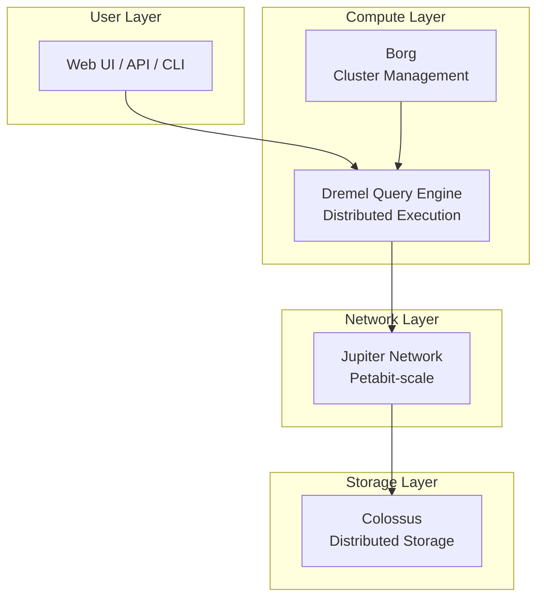

# BigQuery Interview Questions

> [!abstract] Overview
> BigQuery is Google Cloud's **serverless, fully managed data warehouse** designed for large-scale data analytics. It enables high-speed SQL queries on massive datasets without infrastructure management. As of 2024, BigQuery has reached **24.1% adoption** among cloud users (Stack Overflow Survey).

> [!funfact] Performance
> BigQuery can scan **1 terabyte of data in just a few seconds** using its Dremel engine.

---

## Fundamentals & Core Concepts

### Q1: What is BigQuery, and how does it differ from traditional databases?

> [!tip] Answer
> BigQuery is a **fully managed, serverless data warehouse** on Google Cloud designed for large-scale data analytics. It allows high-speed SQL queries on massive datasets without managing infrastructure.

| Feature | Traditional Databases | BigQuery |
|---------|----------------------|----------|
| **Storage** | Row-based | Columnar |
| **Scaling** | Hardware constrained | Near-infinite |
| **Management** | Manual infrastructure | Fully managed |
| **Pricing** | Fixed hardware costs | Pay-as-you-go |
| **Workloads** | OLTP | Analytics (OLAP) |

---

### Q2: What is a dataset in BigQuery?

> [!info] Answer
> A **dataset** is the topmost container that organizes tables, views, and other resources. It:
> - Provides access control boundaries
> - Helps locate and structure data
> - Ensures better query performance through efficient organization

---

### Q3: What data types does BigQuery support?

> [!success] Data Type Categories
>
> **Basic Types:**
> - `BOOL`, `INT64`, `FLOAT64`, `STRING`, `BYTES`
> - `DATE`, `DATETIME`, `TIME`, `TIMESTAMP`
>
> **Complex Types:**
> - `ARRAY` — Repeated fields (multiple values in single column)
> - `STRUCT` — Nested fields (subfields like JSON objects)
> - `JSON` — Semi-structured JSON data
>
> **Specialized Types:**
> - `NUMERIC`, `BIGNUMERIC`
> - `INTERVAL`, `GEOGRAPHY`, `RANGE`

---

### Q4: What are the key advantages of using BigQuery?

> [!tip] Five Main Benefits
>
> 1. **Scalability** — Easily scale resources up or down without hardware investment
> 2. **Flexibility** — Infrastructure can be modified based on business needs
> 3. **High Security** — Automatic backups, encryption, and disaster recovery
> 4. **Cost Effective** — Pay-as-you-go pricing model
> 5. **Data Sharing** — Cloud-based collaboration and sharing capabilities

---

## Architecture

### Q5: How is BigQuery's architecture designed?



> [!info] Core Components
>
> | Component | Role |
> |-----------|------|
> | **Dremel** | Query execution engine; reads columnar data, distributes work across slots |
> | **Colossus** | Global distributed storage; durability and quick data access |
> | **Jupiter** | High-speed network; moves data between compute and storage with low latency |
> | **Borg** | Cluster management (precursor to Kubernetes); orchestrates resources |

---

### Q6: How does BigQuery separate storage and compute?

> [!success] Decoupled Architecture
>
> **Storage:** Data stored in **Colossus** — Google's global distributed storage system
> **Compute:** Query execution handled by **Dremel** with dynamic slot allocation

**Key Benefits:**

| Benefit | Description |
|---------|-------------|
| **Independent Scaling** | Scale storage without affecting compute and vice versa |
| **Cost Efficiency** | Pay only for data scanned during queries |
| **Optimized Performance** | Storage doesn't bottleneck computation |
| **Multi-region Storage** | Data stored across locations without impacting speed |

---

### Q7: What is Dremel, and how does it enable fast query performance?

> [!tip] Dremel Query Engine
>
> **Dremel** is a distributed query execution engine that uses:
>
> 1. **Columnar Storage** — Scans only necessary columns, not entire rows
> 2. **Tree-Based Execution** — Queries broken into fragments, executed in parallel across thousands of nodes
> 3. **Serverless Resource Allocation** — Dynamically assigns compute slots based on query complexity

> [!success] Key Benefits
> - Blazing-fast queries on petabyte-scale datasets
> - Cost-efficient by scanning only relevant columns
> - Automatic parallelization without manual tuning

---

## Data Ingestion & Loading

### Q8: How do you load data into BigQuery?

> [!info] Ingestion Methods
>
> | Method | Use Case | Description |
> |--------|----------|-------------|
> | **Batch Load** | Historical/bulk data | Load from Cloud Storage via UI, `bq` CLI, or API |
> | **Streaming Inserts** | Real-time data | Push individual records via Streaming API |
> | **Data Transfer Service** | Scheduled imports | Automated imports from Google Ads, YouTube, SaaS tools |
> | **Dataflow** | ETL pipelines | Real-time processing with Pub/Sub → Dataflow → BigQuery |

---

### Q9: What is the BigQuery Data Transfer Service?

> [!note] Answer
> **BQ DTS** automates and schedules data imports from external sources:
>
> - **Google Services:** Google Ads, YouTube, Cloud Storage
> - **Third-Party SaaS:** Various external applications
> - **Benefits:** Eliminates manual ETL, ensures data stays up-to-date

---

## Performance Optimization

### Q10: What is partitioning in BigQuery?

> [!tip] Answer
> **Partitioning** subdivides large tables into smaller segments based on a criterion (date, ingestion time, integer range).

**Partition Types:**

| Type | Best For | Example |
|------|----------|---------|
| **Time-based** | Time-series data | Daily `sales_date` partitions |
| **Integer Range** | Numeric values | `user_id` ranges |
| **Ingestion-time** | Load timestamp | `_PARTITIONDATE` |

> [!success] Benefits
> - Restricts data scanned during queries
> - Reduces query costs
> - Critical for time-series analysis

---

### Q11: What is clustering in BigQuery?

> [!info] Answer
> **Clustering** organizes data **within** a table or partition by sorting based on selected column values.

**How it works:**
- Groups related rows together
- Query engine can skip irrelevant data
- Works best combined with partitioning

> [!success] Best Use Cases
> - Filtering by frequently queried fields (region, user_id)
> - Aggregations on clustered columns
> - Large datasets with repeated filter patterns

```sql
-- Example: Create partitioned and clustered table
CREATE TABLE project.dataset.sales (
  sale_id INT64,
  sale_date DATE,
  region STRING,
  amount FLOAT64
)
PARTITION BY sale_date
CLUSTER BY region, sale_id;
```

---

### Q12: Partitioning vs Clustering — When to use each?

> [!tip] Decision Guide
>
> | Scenario | Recommendation |
> |----------|----------------|
> | Time-series queries | Partition by date |
> | Filtering by specific columns | Cluster by those columns |
> | Large tables with predictable filters | **Both** partitioning AND clustering |
> | Ad-hoc analytics on various dimensions | Clustering alone |

---

## Tables, Views & Materialized Views

### Q13: What is the difference between a table and a view?

> [!info] Key Distinction
>
> | Feature | Table | View |
> |---------|-------|------|
> | **Data Storage** | Physically holds data | Virtual (no storage) |
> | **Query Execution** | Direct data access | Dynamically executes SQL |
> | **Use Case** | Primary data storage | Reusable queries, security abstraction |
> | **Performance** | Faster for direct access | May be slower (executes underlying query) |

---

### Q14: What are materialized views?

> [!success] Answer
> **Materialized views** store **precomputed query results**, providing:
>
> - **Faster queries** — Results already computed
> - **Lower costs** — Less data scanned
> - **Automatic refresh** — BigQuery keeps them updated

> [!tip] Best For
> - Dashboards requiring low latency
> - Queries that refresh often
> - Heavy aggregations on large tables

---

### Q15: When to use materialized views vs scheduled queries vs persisted tables?

> [!info] Decision Matrix
>
> | Option | Best For |
> |--------|----------|
> | **Materialized Views** | Frequent refreshes, low latency needs |
> | **Scheduled Queries** | Daily/hourly transformations, write to table |
> | **Persisted Tables** | Heavy dashboards, performance > storage cost |

---

## Security & Access Control

### Q16: How does BigQuery handle data security?

> [!warning] Layered Security Approach
>
> **At Rest:**
> - Encrypted by default (Google-managed keys)
> - Customer-managed encryption keys (CMEK) available
>
> **In Transit:**
> - HTTPS/TLS encryption
>
> **Access Control:**
> - **IAM roles** for project/dataset permissions
> - **Authorized views** — Users see only selected fields
> - **Row-level security** — Restrict data at row level
> - **Column-level security** — Hide sensitive attributes
>
> **Monitoring:**
> - **Audit logging** — Track user and system activity

---

### Q17: What patterns do you use for secure access control?

> [!tip] Access Control Patterns
>
> 1. **IAM Roles** — Foundation for project/dataset permissions
> 2. **Authorized Views** — Expose only selected fields
> 3. **Row-Level Security** — Filter rows based on user context
> 4. **Column-Level Security** — Mask/hide PII columns
> 5. **Combine patterns** for compliance requirements

---

## Advanced Topics

### Q18: What are nested and repeated fields?

> [!info] Semi-Structured Data Support
>
> **Nested Fields (STRUCT):**
> - Column contains subfields (like JSON object)
> - `STRUCT<name STRING, age INT64>`
>
> **Repeated Fields (ARRAY):**
> - Single column stores multiple values
> - `ARRAY<STRING>`
>
> **Benefits:**
> - Eliminate complex JOINs
> - Improve query performance
> - Store hierarchical/array data natively

```sql
-- Example: Query nested/repeated data
SELECT
  order_id,
  SUM(item.qty * item.price) AS order_revenue
FROM orders AS o
LEFT JOIN UNNEST(o.items) AS item
GROUP BY order_id;
```

---

### Q19: What are federated queries?

> [!note] Answer
> **Federated queries** allow BigQuery to query external data sources **without loading**:
>
> - **Google Cloud Storage**
> - **Cloud SQL**
> - **Google Drive**
> - **Bigtable**, **Spanner**
>
> **Trade-offs:**
> - ✅ Saves time, avoids extra storage costs
> - ❌ Slower performance (data not stored natively)

---

### Q20: What is BigQuery ML?

> [!success] Answer
> **BigQuery ML** lets you train and run ML models directly with SQL:
>
> **Use Cases:**
> - Churn prediction
> - Forecasting
> - Recommendations
> - Text classification
>
> **Supported Models:**
> - Boosted trees
> - Deep neural networks
> - Logistic/linear regression
> - K-means clustering
> - Vertex AI integrations

---

### Q21: What are slots in BigQuery?

> [!info] Compute Capacity
> **Slots** are units of computational capacity for processing queries.

| Type | Description | Best For |
|------|-------------|----------|
| **On-demand** | Auto-scale based on query needs | Variable workloads |
| **Reserved** | Fixed capacity, predictable pricing | Consistent, large workloads |

> [!tip] When to Buy Commitments
> - Workloads are consistent and large
> - Flat-rate pricing saves vs pay-per-query
> - Need predictable performance

---

## Cost Management

### Q22: What are best practices for managing BigQuery costs?

> [!warning] Cost Optimization Strategies
>
> 1. **Avoid `SELECT *`** — Query only required columns
> 2. **Use Partitioning** — Reduce data scanned
> 3. **Use Clustering** — Skip irrelevant data
> 4. **Leverage Caching** — Repeated queries use cached results
> 5. **Dry Runs** — Estimate costs before execution
> 6. **Slot Reservations** — Predictable pricing for steady workloads
> 7. **Clean Up** — Remove unused tables/partitions
> 8. **Budgets & Alerts** — Set up cost controls in GCP

---

### Q23: How do you profile and reduce query costs?

> [!tip] Cost Reduction Steps
>
> 1. Check **query statistics** for bytes scanned
> 2. Run **dry runs** to estimate costs
> 3. Avoid `SELECT *` — choose only required columns
> 4. Use **partitioned** and **clustered** tables
> 5. Leverage **caching** for repeated queries
> 6. Use **approximate functions** (`APPROX_COUNT_DISTINCT`) when exact precision isn't needed

---

## SQL Interview Questions

### Q24: Write a query to rank the last 5 transactions per customer

```sql
WITH ranked_txns AS (
  SELECT
    customer_id,
    txn_id,
    txn_ts,
    ROW_NUMBER() OVER (
      PARTITION BY customer_id
      ORDER BY txn_ts DESC
    ) AS rn
  FROM `project.dataset.transactions`
)
SELECT customer_id, txn_id, txn_ts
FROM ranked_txns
WHERE rn <= 5;
```

---

### Q25: Calculate percentage contribution by product to total revenue

```sql
SELECT
  product_id,
  SUM(net_revenue) AS revenue,
  SAFE_DIVIDE(
    SUM(net_revenue),
    SUM(SUM(net_revenue)) OVER ()
  ) AS pct_total
FROM `project.dataset.sales`
GROUP BY product_id;
```

---

### Q26: Remove duplicate records while preserving table name

```sql
CREATE OR REPLACE TABLE tableX AS
SELECT * EXCEPT(row_number)
FROM (
  SELECT
    *,
    ROW_NUMBER() OVER (
      PARTITION BY troubleColumn
      ORDER BY someOtherColumn
    ) AS row_number
  FROM tableX
)
WHERE row_number = 1;
```

---

### Q27: Query nested ARRAY data with UNNEST

```sql
SELECT
  o.order_id,
  SUM(i.qty * i.price) AS order_revenue
FROM `project.dataset.orders` AS o
LEFT JOIN UNNEST(o.items) AS i
GROUP BY o.order_id;
```

---

## Scenario-Based Questions

### Q28: How do you optimize a slow dashboard query on billions of rows?

> [!tip] Optimization Steps
>
> 1. **Profile the query** — Check execution details
> 2. **Avoid `SELECT *`** — Query only needed columns
> 3. **Apply partitioning** — Filter by date/time ranges
> 4. **Add clustering** — On frequently filtered columns
> 5. **Use materialized views** — Pre-compute aggregations
> 6. **Consider scheduled queries** — Pre-aggregate to summary tables
> 7. **Check join order** — Smaller tables first
> 8. **Use broadcast joins** — For small-to-large table joins

---

### Q29: How do you design ingestion at scale and monitor reliability?

> [!info] Architecture Pattern
>
> **Batch Jobs:** Cloud Storage → Load Jobs
> **Real-time:** Pub/Sub → Dataflow → BigQuery
> **SaaS Data:** Data Transfer Service
>
> **Monitoring:**
> - Cloud Monitoring metrics
> - Error logs
> - Alerts for failures/latency

---

### Q30: How do you handle schema changes in BigQuery?

> [!warning] Schema Evolution Rules
>
> | Change | Supported |
> |--------|-----------|
> | Add columns | ✅ Yes |
> | Remove columns | ❌ Requires table rebuild |
> | Change column type | ❌ Requires table rebuild |
> | Relax mode (NULL → REPEATED) | ✅ Yes |
> | Make required (NULLABLE → REQUIRED) | ❌ Only if no NULLs exist |

---

## Advanced Features & Services

### Q31: What is BigQuery Omni?

> [!info] Multi-Cloud Analytics
> **BigQuery Omni** is an extension that allows you to analyze data across multiple clouds (Google Cloud, AWS, Azure) using a **unified interface**.

**Benefits:**
- Consistent experience across clouds
- Query data where it resides (no data movement)
- Single control plane for governance

---

### Q32: What is BigQuery BI Engine?

> [!success] In-Memory Analysis
> **BI Engine** is an in-memory analysis service that provides **highly interactive, low-latency** query performance for BI tools.

**Best For:**
- Real-time data exploration
- Dashboards requiring sub-second responses
- Large dataset visualization

---

### Q33: What is the BigQuery Storage API?

> [!tip] High-Performance Data Access
> The **Storage API** enables high-performance read and write access to BigQuery data.

**Use Cases:**
- Efficient data ingestion
- Fast data exports
- Integration with external tools needing direct access

---

### Q34: What is the BigQuery Data Catalog?

> [!note] Centralized Metadata Management
> **Data Catalog** is a metadata management service that allows you to:
> - Register and discover datasets
> - Search across tables, views, and resources
> - Promote data discoverability and governance

---

### Q35: What is BigQuery Data QnA?

> [!info] Natural Language Interface
> **Data QnA** allows users to query BigQuery using **conversational language**. It uses ML to understand queries and provide results.

---

## Data Management & Recovery

### Q36: What is Time Travel in BigQuery?

> [!tip] Historical Data Access
> **Time Travel** allows you to query data at **specific points in time** within a defined retention period.

**Use Cases:**
- Analyze historical data states
- Recover from accidental changes/deletions
- Audit data changes over time

```sql
-- Query table as of 1 hour ago
SELECT * FROM `project.dataset.table`
FOR SYSTEM_TIME AS OF TIMESTAMP_SUB(CURRENT_TIMESTAMP(), INTERVAL 1 HOUR);
```

---

### Q37: Table Decorators vs Snapshot Decorators

> [!info] Key Differences
>
> | Feature | Table Decorator | Snapshot Decorator |
> |---------|-----------------|-------------------|
> | **Purpose** | Query specific point in time for one table | Query consistent snapshot of all tables in dataset |
> | **Scope** | Single table | Entire dataset |
> | **Use Case** | Historical analysis of specific table | Cross-table historical consistency |

---

### Q38: How does BigQuery handle data backup and recovery?

> [!success] Built-in Protection
>
> - **Automatic replication** across multiple storage locations within a region
> - **Time Travel** — Query historical states within retention period
> - **Table snapshots** — Point-in-time recovery
> - **No manual backup required** — Managed by Google

---

### Q39: How does BigQuery handle data deduplication?

> [!warning] No Built-in Deduplication
> BigQuery does **not** provide automatic deduplication. Solutions:
>
> 1. **Pre-process data** before loading
> 2. **Use `ROW_NUMBER()`** to identify and remove duplicates
> 3. **Leverage unique keys** during ingestion

---

### Q40: What is data sharding in BigQuery?

> [!info] Answer
> **Data sharding** divides large datasets into smaller pieces (shards) based on a shard key.

**Benefits:**
- Distributes data across nodes
- Improves query performance when querying specific shards
- Common with date-sharded tables

---

### Q41: What are wildcard tables?

> [!tip] Pattern-Based Querying
> **Wildcard tables** allow querying multiple tables matching a pattern using a single query.

```sql
-- Query all tables matching pattern
SELECT *
FROM `project.dataset.sales_*`
WHERE _TABLE_SUFFIX BETWEEN '20240101' AND '20240131';
```

**Best For:**
- Date-sharded tables
- Partitioned legacy tables
- Cross-table analysis

---

## Streaming & Real-Time

### Q42: What is the streaming buffer?

> [!info] Temporary Storage
> When data is streamed into BigQuery, it lands in a **streaming buffer** before being written to permanent storage.

**Characteristics:**
- Data is immediately queryable
- Subject to certain limitations (no partition pruning)
- Data eventually flushed to permanent storage

---

### Q43: What are the limitations of streaming inserts?

> [!warning] Streaming Constraints
>
> | Limitation | Details |
> |------------|---------|
> | **Cost** | Higher than batch loading |
> | **Rate limits** | Max rows per second per table |
> | **No updates/deletes** | Cannot modify individual streamed records |
> | **Partition limitations** | No partition pruning while in buffer |

---

### Q44: How do you monitor streaming pipelines?

> [!tip] Monitoring Strategies
>
> 1. **Review streaming buffer statistics**
> 2. **Monitor streaming API errors and quotas**
> 3. **Use Cloud Monitoring and Cloud Logging**
> 4. **Set up alerts for failures/latency**

---

## Query Optimization Deep Dive

### Q45: How does query caching work in BigQuery?

> [!success] Automatic Caching
> BigQuery **automatically caches** results of recent queries.

**How it works:**
- Results cached for **24 hours**
- Identical queries served from cache
- **No processing cost** for cached results

**When cache is NOT used:**
- Non-deterministic functions (`CURRENT_TIMESTAMP()`)
- Streaming buffer data
- Tables modified since last query

---

### Q46: How does BigQuery handle data skew and hotspots?

> [!info] Automatic Handling
> BigQuery's query optimizer **automatically handles skew** by:
>
> - Redistributing data during execution
> - Dynamically adjusting data distribution
> - Balancing processing across nodes

---

### Q47: How does BigQuery handle data consistency in distributed queries?

> [!warning] Eventual Consistency
> BigQuery is designed for **eventual consistency** in distributed queries.
>
> - Results may not reflect latest changes immediately
> - Queries are consistent within a **single table or partition**
> - Optimized for analytical (not transactional) workloads

---

## Pricing Models & Reservations

### Q48: What are the different pricing models?

> [!tip] Pricing Options
>
> | Model | Description | Best For |
> |-------|-------------|----------|
> | **On-demand** | Pay per TB of data scanned | Variable workloads |
> | **Flat-rate (Slots)** | Fixed monthly commitment | Predictable workloads |
> | **Editions** | Enterprise/Standard with different features | Various enterprise needs |

---

### Q49: Explain slot reservations in detail

> [!success] Slot Commitments
>
> **Slot reservations** allocate dedicated compute capacity:
>
> - **Commitment types:** Flex, Monthly, Annual
> - **Predictable pricing** vs pay-per-query
> - **Guaranteed capacity** during peak times
>
> **When to buy:**
> - Workloads are consistent and large
> - Flat-rate saves vs on-demand costs
> - Need guaranteed performance

---

### Q50: What is BigQuery's workload management?

> [!info] Resource Allocation
> **Workload management** allows you to:
>
> - Allocate and prioritize resources for different query types
> - Define query priorities
> - Set concurrency limits
> - Ensure optimal resource allocation

---

## Automation & Orchestration

### Q51: How can you automate tasks with Cloud Functions?

> [!tip] Serverless Automation
> **Cloud Functions** can automate BigQuery tasks by:
>
> - Triggering on events (new data in bucket, schedule)
> - Executing BigQuery queries
> - Performing data transformations

---

### Q52: How can you automate with Cloud Composer?

> [!info] Managed Airflow
> **Cloud Composer** (managed Apache Airflow) can:
>
> - Create and schedule workflows with BigQuery operations
> - Orchestrate complex data pipelines
> - Handle dependencies between tasks

---

### Q53: What is the role of service accounts?

> [!note] Non-Human Authentication
> **Service accounts** authenticate applications and processes:
>
> - Grant permissions to data pipelines
> - Authorize automated processes
> - Control access for non-human entities

---

## BigQuery ML Deep Dive

### Q54: What is the CREATE MODEL statement?

> [!success] Model Creation
> **CREATE MODEL** builds ML models using SQL:

```sql
CREATE MODEL `project.dataset.model_name`
OPTIONS(
  model_type='logistic_reg',
  input_label_cols=['label']
) AS
SELECT * FROM `project.dataset.training_data`;
```

---

### Q55: What is the ML.EVALUATE statement?

> [!info] Model Assessment
> **ML.EVALUATE** measures model performance:
>
> - Returns metrics: accuracy, precision, recall, ROC AUC
> - Compares predictions against known labels
> - Validates model quality

```sql
SELECT *
FROM ML.EVALUATE(MODEL `project.dataset.model_name`,
  (SELECT * FROM `project.dataset.test_data`));
```

---

### Q56: What is the ML.TRANSFORM statement?

> [!tip] Feature Engineering
> **ML.TRANSFORM** performs feature engineering within ML context:
>
> - Preprocess data before training
> - Create new features
> - Apply transformations consistently

---

## Specialized Features

### Q57: What are geographic data types?

> [!info] GEOGRAPHY Type
> BigQuery supports **spatial data** for location-based analysis:
>
> - **Types:** Points, lines, polygons
> - **Functions:** Distance calculations, spatial joins
> - **Use cases:** Geolocation, mapping, spatial analytics

```sql
SELECT ST_DISTANCE(
  ST_GEOGPOINT(lon1, lat1),
  ST_GEOGPOINT(lon2, lat2)
) AS distance_meters;
```

---

### Q58: What is the INFORMATION_SCHEMA?

> [!note] Metadata Access
> **INFORMATION_SCHEMA** provides metadata about:
>
> - Datasets, tables, views
> - Columns and their types
> - Partitions and clustering
> - Jobs and reservations

```sql
SELECT table_name, row_count
FROM `project.dataset.INFORMATION_SCHEMA.TABLES`;
```

---

### Q59: What is BigQuery billing export?

> [!tip] Cost Analysis
> **Billing export** provides detailed usage data:
>
> - Export to BigQuery tables for analysis
> - Granular resource usage and cost information
> - Enables cost optimization and trend analysis

---

### Q60: How do you handle schema evolution?

> [!info] Flexible Schema Changes
>
> | Change | Method |
> |--------|--------|
> | **Add columns** | Direct ALTER TABLE or auto-detect |
> | **Schema inference** | Auto-detect new columns when querying |
> | **Column relaxation** | NULLABLE → REPEATED supported |

---

## Quick Reference: Most Frequently Asked Questions

> [!abstract] Key Questions to Master
>
> 1. What is BigQuery and how is it different from traditional databases?
> 2. Explain BigQuery architecture (Dremel, Colossus, Jupiter, Borg)
> 3. What is the difference between partitioning and clustering?
> 4. How do you load data into BigQuery?
> 5. What are nested and repeated fields? How do you query them?
> 6. How does BigQuery handle security?
> 7. What are slots and when would you use reservations?
> 8. How do you optimize query performance and reduce costs?
> 9. What is the difference between tables, views, and materialized views?
> 10. What are federated queries and when would you use them?

---

## Related Notes

- [[SQL Interview Questions]]
- [[Database Fundamentals Interview Questions]]
- [[System Design Framework]]
- [[Unity Catalog]] — Lakehouse governance

---

> [!quote] Sources
> - CloudFoundation: BigQuery Interview Questions & Answers
> - DataCamp: Top BigQuery Interview Questions and Answers for 2025
> - Hirist: Top 25+ BigQuery Interview Questions and Answers
> - Yash Raut (LinkedIn): GCP Interview Q&As for Data Engineers
