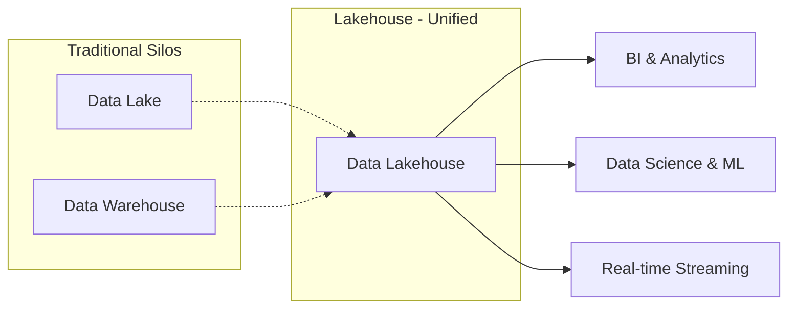
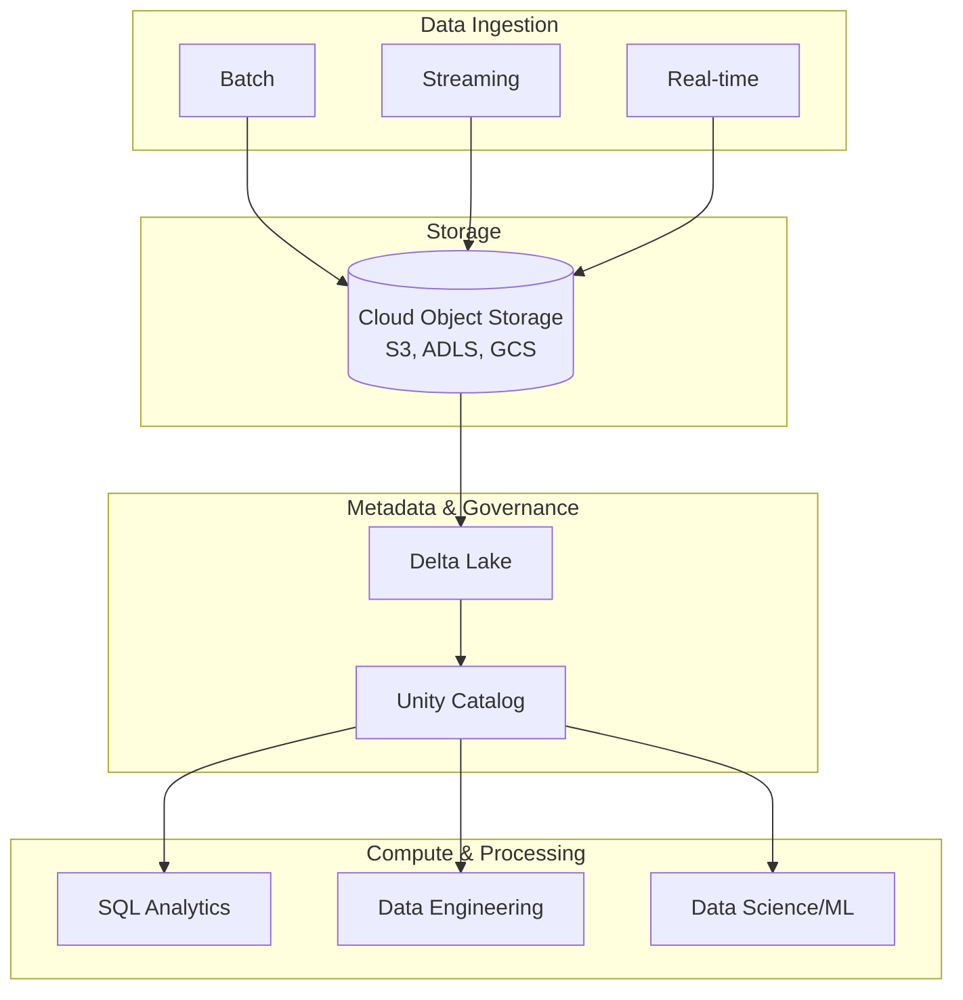
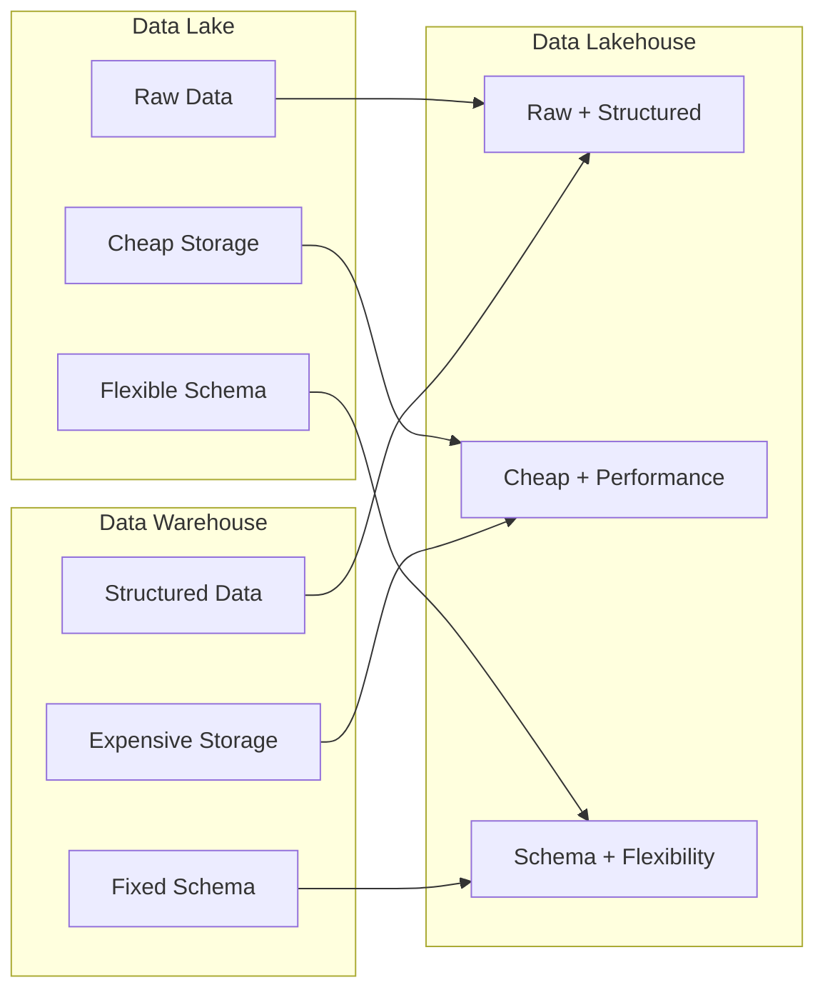
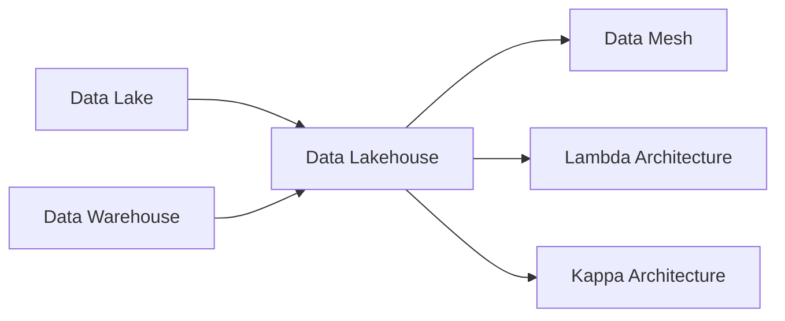

# Data Lakehouse

The Data Lakehouse is a modern data architecture pattern that combines the best elements of **data lakes** and **data warehouses**. It enables you to reduce costs while delivering on data and AI initiatives faster by bringing together reliability, flexibility, and performance in a single platform.

## What is a Lakehouse?

A Lakehouse architecture unifies:
- **Data Lake** benefits: Low-cost storage, support for diverse data types (structured, semi-structured, unstructured), and flexibility
- **Data Warehouse** benefits: ACID transactions, schema enforcement, SQL support, and BI tool integration

## Key Characteristics

### Unified
- One architecture for integration, storage, processing, governance, sharing, analytics and AI
- One approach for structured and unstructured data
- One end-to-end view of data lineage and provenance
- One toolset for Python and SQL, batch and streaming, across all major cloud providers

### Open
- Built on open source and open standards (Apache Spark, Delta Lake, MLflow)
- No proprietary formats or closed ecosystems
- Data always under your control
- Open sharing via Delta Sharing

### Scalable
- Automatic optimization for performance and storage
- Lowest TCO of any data platform
- World-record-setting performance for data warehousing and AI workloads
- Supports both startups and global enterprises

## Lakehouse Architecture Layers

## Lakehouse Advantages

| Benefit | Description |
|---------|-------------|
| **Simplified Architecture** | Eliminates data silos between lake and warehouse |
| **Cost Effective** | Cheap object storage with high-performance query capabilities |
| **ACID Transactions** | Reliable data consistency and concurrency |
| **Schema Enforcement** | Data quality and governance at scale |
| **BI Support** | Direct SQL access for BI tools |
| **AI/ML Native** | Built-in support for machine learning workloads |
| **Open Standards** | Avoid vendor lock-in with open formats |
| **Time Travel** | Query data at any point in time |

## Lakehouse vs Traditional Architectures

| Feature | Data Lake | Data Warehouse | Data Lakehouse |
|---------|-----------|---------------|---------------|
| Storage Cost | Low | High | Low |
| Data Types | All | Structured only | All |
| Schema | Flexible/On-read | Enforced/On-write | Both |
| ACID Transactions | No | Yes | Yes |
| BI Support | Limited | Excellent | Excellent |
| ML/AI Support | Excellent | Limited | Excellent |
| Data Quality | Low | High | High |

## Core Technologies

### Delta Lake
- ACID transactions on data lake
- Schema enforcement and evolution
- Time travel (data versioning)
- Upsert and delete capabilities

### Apache Spark
- Unified analytics engine for big data
- Batch and stream processing
- SQL, Python, R, Scala support

### MLflow
- End-to-end ML lifecycle management
- Experiment tracking
- Model registry
- Deployment

## Use Cases

1. **Enterprise Data Warehousing**
   - Modernize legacy warehouse with lower costs
   - Support diverse data types beyond just structured

2. **Data Science & Machine Learning**
   - Direct access to raw and processed data
   - Unified platform for experiment and production

3. **Real-time Analytics**
   - Streaming data with batch historical analysis
   - Lambda and Kappa architecture patterns

4. **Data Mesh Implementation**
   - Domain-oriented data products with governance
   - Self-service platform for data teams

## Cloud Provider Implementations

- **Databricks Lakehouse**: AWS, Azure, GCP
- **Azure Synapse**: Built on Delta Lake
- **Google BigLake**: BigQuery + Cloud Storage
- **AWS Athena + Lake Formation**: S3-based lakehouse

## Knowledge Graph Connections

**Relationship with Other Patterns**:
- **vs Data Lake**: Adds reliability, governance, and performance
- **vs Data Warehouse**: Adds flexibility, ML support, and lower cost
- **vs Data Mesh**: Can serve as the platform for Data Mesh implementation
- **vs Lambda/Kappa**: Provides the storage layer for streaming architectures

## Learning Resources

- [Databricks Lakehouse Architecture](https://www.databricks.com/product/data-lakehouse)
- [Well-Architected Lakehouse Framework](https://docs.databricks.com/aws/en/lakehouse-architecture/)
- [Delta Lake Guide](https://www.databricks.com/blog/delta-lake-the-definitive-guide)

## When to Use a Lakehouse

Consider a Lakehouse when you:
- Need both data warehouse performance and data lake flexibility
- Want to support BI, ML, and streaming on one platform
- Need ACID transactions on diverse data types
- Want to avoid data silos between warehouse and lake
- Require open standards to avoid vendor lock-in

---

**Sources**: [Databricks](https://www.databricks.com/product/data-lakehouse) | [Databricks Docs](https://docs.databricks.com/aws/en/lakehouse-architecture/)
