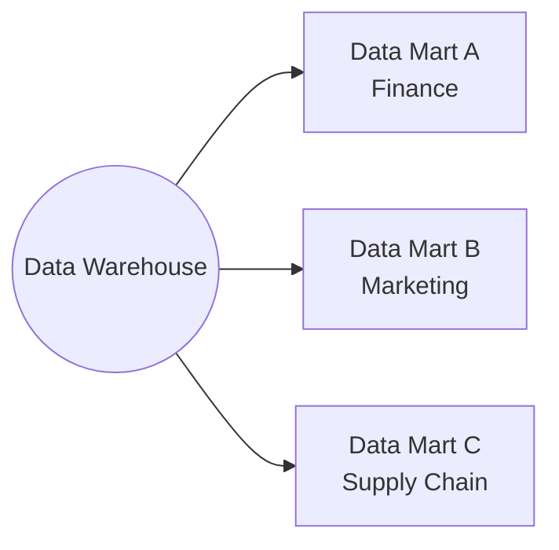
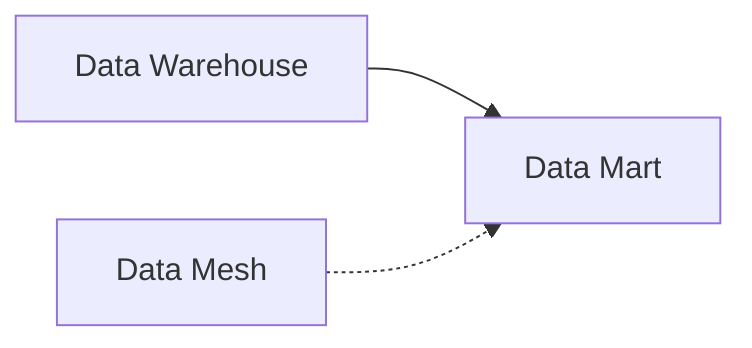

# Data Mart

A data mart is a subject-specific database which acts as a partitioned segment of an enterprise data warehouse. The domain of a data mart aligns with a particular business unit - for instance there would be separate data marts created for finance, marketing, or supply chain departments within a company.

## Data Mart Advantages

- In general, better performance due to querying only a subset of data rather than a whole data warehouse
- Should also require less resources and maintenance than a monolithic data warehouse
- The domain focus means data marts should be more flexible and grant bigger user empowerment and encouragement
- Faster query performance for specific business units
- Easier to understand and navigate for domain-specific users

## Data Mart Disadvantages

- Data quality risk - the risk of arising discrepancies between a data mart and the original data warehouse
- Implementation challenges - poor design may lead to extensive complexity and inconsistencies over time
- Potential data redundancy across marts
- Additional ETL/ELT processes to maintain

## Data Mart vs Data Warehouse

| Aspect | Data Warehouse | Data Mart |
|--------|---------------|-----------|
| Scope | Enterprise-wide | Department-specific |
| Data Volume | Large | Subset of warehouse |
| Users | All stakeholders | Specific business unit |
| Complexity | High | Lower |
| Performance | Good for varied queries | Optimized for specific queries |

## Data Mart vs Data Mesh

While both seem similar (domain-oriented), Data Marts are typically subsets of a centralized warehouse, while Data Mesh is a fully decentralized architecture where domains own their data products end-to-end.

## Learning Resources

- [What is a Data Mart? - AWS](https://aws.amazon.com/what-is/data-mart/)

## Knowledge Graph Connections

**When to Use Data Marts**:
- When you have a mature data warehouse
- Different departments have different query patterns
- You need to isolate department-specific workloads
- When centralized governance is important

---

**Source**: [Data Engineering Wiki](https://dataengineering.wiki/Concepts/Data+Architecture/Data+Mart)
