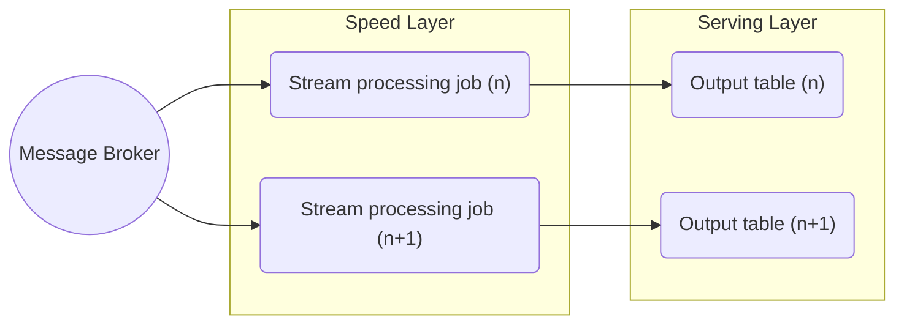
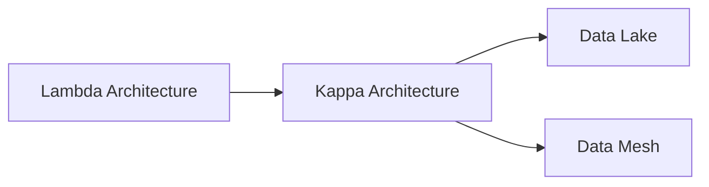

# Kappa Architecture

Kappa architecture is a big data processing pattern that has historically diverged from Lambda Architecture. Its foundation is to treat all arriving data as a stream, therefore it contains no batch layer by design, relying solely on a stream processing layer ("speed layer").

## Kappa Architecture Advantages

- Only need to maintain, develop and debug a much smaller codebase compared to Lambda architecture
- Advantageous for use cases that require high data velocity
- Simpler operational model
- Unified processing logic

## Kappa Architecture Disadvantages

- General challenges related to implementing stream processing at scale
- Higher data loss risks by design - requires specific data storage and recovery strategies
- Recomputation for historical data can be expensive

## Kappa vs Lambda Architecture

| Aspect | Lambda | Kappa |
|--------|--------|-------|
| Layers | Batch + Speed + Serving | Speed + Serving only |
| Complexity | High (duplicate code) | Lower (single codebase) |
| Processing | Batch + Real-time | Stream-only |
| Recomputation | Fast (batch layer) | Expensive (replay stream) |

## Learning Resources

- [Questioning the Lambda Architecture – O'Reilly](https://www.oreilly.com/radar/questioning-the-lambda-architecture/)

## Knowledge Graph Connections

**When to Use Kappa**:
- When you need simpler architecture than Lambda
- For real-time analytics use cases
- When stream processing is your primary pattern
- When you can afford stream replay for re-computation

---

**Source**: [Data Engineering Wiki](https://dataengineering.wiki/Concepts/Data+Architecture/Kappa+Architecture)
