# Knowledge Graph - Data Engineering Knowledge Base

## Graph Visualization

```mermaid
graph TD
    %% Root
    ROOT[README.md]

    %% Main Categories
    ROOT --> Areas[02-Areas]
    ROOT --> Resources[03-Resources]
    ROOT --> Archive[04-Archive]
    ROOT --> Interview[05-Interview Prep]
    ROOT --> Skills[Skills Tracker]
    ROOT --> Daily[Daily Notes]

    %% Areas - Streaming
    Areas --> Streaming[Streaming]
    Streaming --> Flink[Apache Flink - Real-Time Analytics]
    Streaming --> Kafka[Apache Kafka - Event Streaming]

    %% Areas - Other
    Areas --> Modeling[Data Modeling]
    Areas --> Warehouse[Data Warehousing]
    Areas --> SQL[SQL]

    %% Resources
    Resources --> Trends[Data Engineering Trends 2026]

    %% Skills Tracker
    Skills --> Progress[Progress Matrix]
    Skills --> Roadmap[Interview Roadmap]

    %% Daily Notes - 2026-02-14
    Daily --> DailyIndex[_Index.md]
    DailyIndex --> DailyFlink[Streaming - Apache Flink]
    DailyIndex --> DailyKafka[Apache Kafka - Event Streaming]
    DailyIndex --> DailyTrends[Data Engineering Trends 2026 Research]

    %% Archive
    Archive --> Lambda[Lambda Architecture]
    Archive --> Lakehouse[Data Lakehouse]
    Archive --> Mesh[Data Mesh]
    Archive --> Kappa[Kappa Architecture]
    Archive --> Lake[Data Lake]

    %% Connections
    Flink -.-> Kafka
    Flink -.-> Windowing[Windowing]
    Flink -.-> Watermarks[Watermarks]
    Flink -.-> ExactlyOnce[Exactly-Once]
    Flink -.-> Backpressure[Backpressure]

    Kafka -.-> Topics[Topics]
    Kafka -.-> Partitions[Partitions]
    Kafka -.-> Producers[Producers]
    Kafka -.-> Consumers[Consumers]
    Kafka -.-> ConsumerGroups[Consumer Groups]

    Trends -.-> Streaming
    Trends -.-> Lakehouse
    Trends -.-> ZeroETL[Zero ETL]
    Trends -.-> AI[AI/ML Integration]
    Trends -.-> Platformization[Platformization]
    Trends -.-> DataQuality[Data Quality]

    Skills -.-> Streaming
    Skills -.-> SQL
    Skills -.-> Modeling
    Skills -.-> SystemDesign[System Design]

    %% Styling
    classDef core fill:#4CAF50,color:#fff
    classDef streaming fill:#2196F3,color:#fff
    classDef resources fill:#FF9800,color:#fff
    classDef daily fill:#9C27B0,color:#fff
    classDef concept fill:#607D8B,color:#fff

    class ROOT,Skills,Interview core
    class Streaming,Flink,Kafka streaming
    class Trends resources
    class DailyIndex,DailyFlink,DailyKafka,DailyTrends daily
    class Windowing,Watermarks,ExactlyOnce,Backpressure,Topics,Partitions,Producers,Consumers,ConsumerGroups,ZeroETL,AI,Platformization,DataQuality,Modeling,Warehouse,SQL,SystemDesign,Lambda,Lakehouse,Mesh,Kappa,Lake concept
```



---

## Knowledge Structure

### Core Areas (02-Areas)

| Area | Progress | Notes Created |
|-------|----------|----------------|
| **Streaming** | 75% (6/8) | Flink, Kafka |
| **Data Modeling** | 50% (4/8) | - |
| **Data Warehousing** | 38% (3/8) | - |
| **SQL** | 50% (4/8) | - |

### Resources (03-Resources)

| Resource | Size | Type |
|----------|-------|------|
| **Data Engineering Trends 2026** | 10,396 bytes | Research synthesis |

### Skills Tracker

| File | Purpose |
|------|---------|
| **Progress Matrix** | Track 104 skills across 13 categories |
| **Interview Roadmap** | 16-week study plan |

### Daily Learning (2026-02-14)

| Note | Type |
|------|------|
| **_Index.md** | Daily summary |
| **Streaming - Apache Flink** | Learning log |
| **Apache Kafka - Event Streaming** | Learning log |
| **Data Engineering Trends 2026 Research** | Research log |

---

## Connection Patterns

### Strong Connections

**Streaming Ecosystem**:
```
Apache Kafka → Apache Flink → Windowing/Watermarks/Exactly-Once/Backpressure
     ↓                    ↓
  Producer/Consumer     State Management
```

**Trend Analysis**:
```
Data Engineering Trends 2026
  ├── Streaming-First Lakehouse
  ├── Zero ETL (CDC)
  ├── AI-Assisted Development
  ├── Platformization
  ├── Data Quality First-Class
  └── AI-Ready Pipelines
```

### Wikilink Network

**From Today's Notes**:
- `[[Data Engineering Trends 2026]]` ← Links to all streaming notes
- `[[Apache Flink - Real-Time Analytics]]` ← Links to Kafka, Windowing
- `[[Apache Kafka - Event Streaming]]` ← Links to Flink, Exactly-Once
- `[[Progress Matrix]]` ← Tracks all skills including streaming

---

## Knowledge Gaps

### Missing Connections

| From | To | Action |
|------|-----|--------|
| Streaming | System Design | Link streaming patterns to design |
| Trends | Skills Tracker | Map trends to skills to learn |
| SQL | Streaming | Connect real-time vs batch SQL |

### Orphan Notes

**04-Archive/** (6 notes):
- Lambda Architecture, Data Lakehouse, Data Mesh
- Kappa Architecture, Data Lake, Data Mart
- **Action**: Link to streaming trends note

---

## Next Steps for Knowledge Graph

1. **Create cross-links**: Connect archive notes to current content
2. **Map skills to trends**: Identify what skills align with 2026 trends
3. **System design integration**: Link streaming patterns to design decisions
4. **Practice notes**: Add hands-on labs linked to concepts

---

**Visualization**: Use Mermaid plugin in Obsidian to render graph above

**Interactive Graph**: Open Obsidian graph view (Ctrl+G) to explore connections
